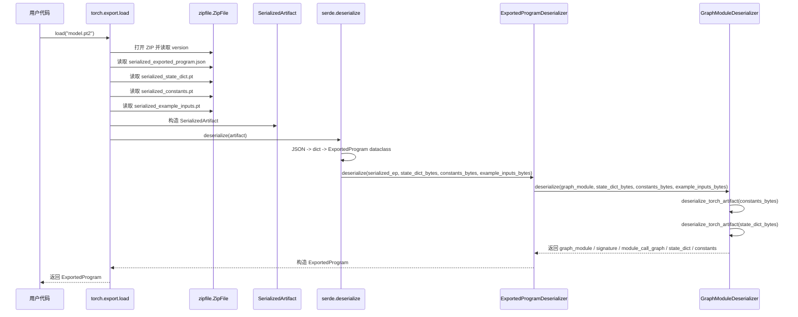
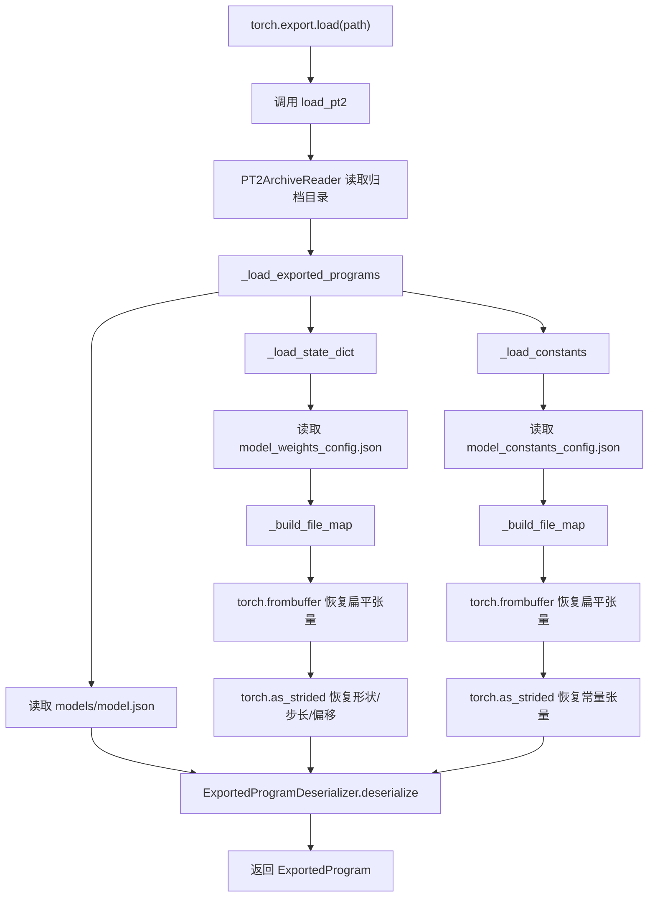
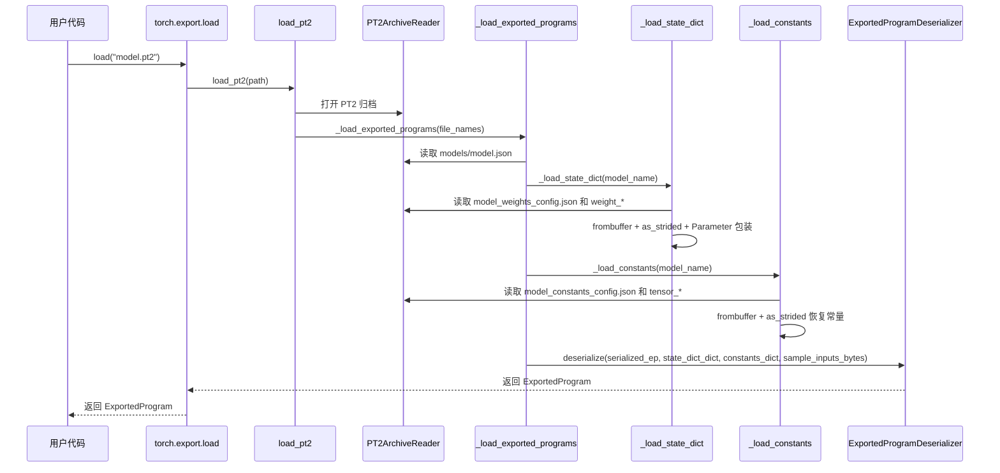
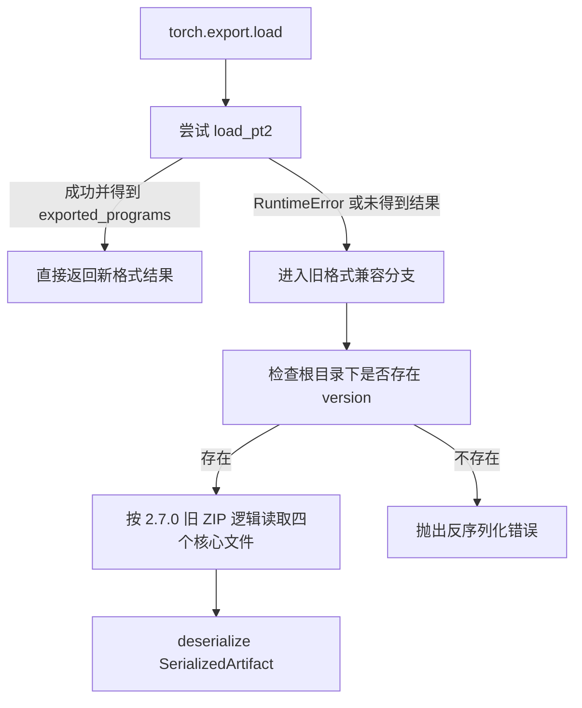
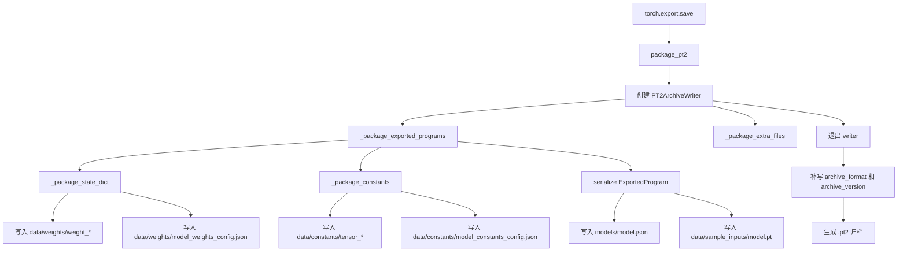

# 理解 PT2 模型归档格式

## 这篇文章想回答什么

`torch.export` 是 PyTorch 2.x 引入的模型导出 API，它会把 `nn.Module` 捕获为一个可序列化的 `ExportedProgram` 对象。这个对象同时保存计算图、参数、缓冲区、常量和调用约束。导出的 `.pt2` 文件本质上是一个 ZIP 归档：其中一部分文件负责描述图结构，另一部分文件负责保存张量数据和归档元信息。

本文基于 PyTorch 2.7.0 和 PyTorch 2.9.0 的实际导出结果，分析 PT2 模型归档格式的组成和实现，包括 `ExportedProgram` 的结构、`torch.export.save` 的保存结果，以及权重、常量和示例输入的落盘方式。

## PT2 归档格式概览

### 模型示例

```python
import torch
import torch.nn as nn

class DemoModel(nn.Module):
    def __init__(self):
        super().__init__()
        # 参数（模型权重，会参与训练）
        self.weight = nn.Parameter(torch.randn(4, 4))
        # 缓冲区（不会训练，但会保存到 state_dict）
        self.register_buffer("running_scale", torch.ones(4))
        # 常量（普通 Python 属性，不会进入 state_dict）
        self.const_bias = torch.tensor([1.0, 2.0, 3.0, 4.0])

    def forward(self, x):
        y = x @ self.weight
        y = y * self.running_scale
        y = y + self.const_bias

        return y


model = DemoModel()
model.eval()
example_input = (torch.randn(2, 4),)
exported_program = torch.export.export(
    model,
    example_input
)
torch.export.save(exported_program, "./demo_model.pt2")
```

### ZIP 结构：从扁平到分层

PyTorch 2.7.0 中的 `.pt2` 格式采用扁平化布局，所有核心对象在解压后直接位于归档根目录下，不包含类似 `demo_model/` 的顶层目录：

```text
serialized_exported_program.json   # 图定义 + 元数据
serialized_state_dict.pt           # 参数 + buffer 的整体 state_dict
serialized_constants.pt            # 常量张量
serialized_example_inputs.pt       # 示例输入
version                            # schema 版本标记
```

PyTorch 2.9.0 的 `.pt2` 采用分层目录结构，按功能组织模型文件。对本文中的示例 `demo_model.pt2`，归档内容如下：

```text
demo_model
├── .data
│   ├── serialization_id
│   └── version
├── archive_format
├── archive_version
├── byteorder
├── data
│   ├── constants
│   │   ├── model_constants_config.json
│   │   └── tensor_0
│   ├── sample_inputs
│   │   └── model.pt
│   └── weights
│       ├── model_weights_config.json
│       ├── weight_0
│       └── weight_1
└── models
    └── model.json
```

这种变化反映了一个明确方向：`.pt2` 从“几个大对象直接打包”演进为“正式的归档格式规范”，模型描述、权重、权重配置、样例输入、归档元信息被结构化管理。

### 文件组成详解

图定义文件在两个版本中都采用 JSON 表示，但文件路径有所不同：

| 版本 | 图定义文件 |
| --- | --- |
| PyTorch 2.7.0 | `serialized_exported_program.json` |
| PyTorch 2.9.0 | `models/model.json` |

它们的顶层结构相似，通常包含 `graph_module`、`opset_version`、`range_constraints`、`schema_version`、`verifiers`、`torch_version` 等字段；在 PyTorch 2.9.0 中还会额外看到 `guards_code`。其中最核心的是 `graph_module.graph`，它记录了导出计算图的输入、输出和节点，对应 `ExportedProgram.graph_module.graph` 的序列化结果。

权重存储方式则是最明显的变化点：

| 版本 | 存储方式 |
| --- | --- |
| PyTorch 2.7.0 | 参数和缓冲区统一保存在 `serialized_state_dict.pt` 中，读取方式基本等价于 `torch.load(...)` |
| PyTorch 2.9.0 | 每个张量拆成独立文件，例如 `weight_0`、`weight_1`；逻辑名称与 `shape`、`dtype`、`device`、`stride` 等元信息的映射保存在 `data/weights/model_weights_config.json` 中 |

这种拆分让外部工具不需要先整体加载一个 `state_dict.pt`，就可以先读取元信息，再按需定位具体张量数据。

示例输入在两个版本里也都被保存下来：

| 版本 | 示例输入文件 |
| --- | --- |
| PyTorch 2.7.0 | `serialized_example_inputs.pt` |
| PyTorch 2.9.0 | `data/sample_inputs/model.pt` |

这类文件通常都可以通过 `torch.load(...)` 恢复，内容一般是 `(args, kwargs)` 形式，便于测试导出结果。

PyTorch 2.9.0 还显式引入了归档级元信息文件：

| 文件 | 含义 |
| --- | --- |
| `archive_format` | 标识当前归档类型为 `pt2` |
| `archive_version` | 归档格式版本 |
| `.data/version` | 内部版本标记 |
| `byteorder` | 字节序信息 |
| `.data/serialization_id` | 序列化标识 |


## ExportedProgram 核心结构

`.pt2` 仅是 `ExportedProgram` 的落盘形式。要理解归档中每个文件的具体来源，需先明确 `ExportedProgram` 在内存中的组织结构。

以本文示例模型为例，在 PyTorch 2.7.0 和 PyTorch 2.9.0 中导出后，`ExportedProgram` 的公共字段基本保持一致，核心字段如下：

| 字段 | 含义 |
| --- | --- |
| `graph` / `graph_module` | 计算图本体 |
| `graph_signature` | 图输入输出的语义签名 |
| `state_dict` | 参数及持久化缓冲区 |
| `constants` | 被提升为图输入的常量张量 |
| `example_inputs` | 导出时使用的示例输入 |
| `range_constraints` | 符号维度约束 |
| `module_call_graph` | 模块级调用关系 |
| `verifiers` | 图一致性校验信息 |

在这些字段中，`graph_module.graph`、`graph_signature`、`state_dict` 和 `constants` 最为关键：

- `graph_module.graph` 记录图中有哪些节点
- `graph_signature` 记录各个图输入分别代表什么
- `state_dict` 记录哪些张量属于模型状态（可训练的参数）
- `constants` 记录哪些张量是常量而非用户输入

### graph 与 graph_signature 的分工

直接打印 `graph_module.graph`，可以看到如下结构：

```python
print(exported_program.graph_module.graph)
graph():
    %p_weight : [num_users=1] = placeholder[target=p_weight]
    %b_running_scale : [num_users=1] = placeholder[target=b_running_scale]
    %c_const_bias : [num_users=1] = placeholder[target=c_const_bias]
    %x : [num_users=1] = placeholder[target=x]
    %matmul : [num_users=1] = call_function[target=torch.ops.aten.matmul.default](args = (%x, %p_weight), kwargs = {})
    %mul : [num_users=1] = call_function[target=torch.ops.aten.mul.Tensor](args = (%matmul, %b_running_scale), kwargs = {})
    %add : [num_users=1] = call_function[target=torch.ops.aten.add.Tensor](args = (%mul, %c_const_bias), kwargs = {})
    return (add,)
```

对应的 `graph_signature` 打印结果如下；在序列化后的 JSON 中，对应字段名为 `graph_module.signature`：

```python
print(exported_program.graph_signature)
# inputs
p_weight: PARAMETER target='weight'
b_running_scale: BUFFER target='running_scale' persistent=True
c_const_bias: CONSTANT_TENSOR target='const_bias'
x: USER_INPUT

# outputs
add: USER_OUTPUT
```

这里有一个很容易误解的点：图中的 `placeholder` 不只对应用户输入。导出后的图会把参数、缓冲区和常量都提升为图输入，再由 `graph_signature` 说明这些输入各自的语义。

在本文示例里，`graph_signature` 的输入分类如下：

| 图输入名 | 分类 | 对应逻辑名称 |
| --- | --- | --- |
| `p_weight` | `PARAMETER` | `weight` |
| `b_running_scale` | `BUFFER` | `running_scale` |
| `c_const_bias` | `CONSTANT_TENSOR` | `const_bias` |
| `x` | `USER_INPUT` | 用户输入 |

也就是说，`graph` 只关心执行时需要哪些值，不直接区分这些值来自模型权重、缓冲区、常量还是用户输入；真正的语义映射由 `graph_signature` 提供。这个分层很重要，因为它把“图执行”与“输入来源”拆开了。

从序列化角度看，这种拆分也非常自然：

| 组成部分 | 作用 |
| --- | --- |
| `graph_module.graph` | 记录节点和数据流 |
| `graph_module.signature` | 记录占位符到逻辑名称的映射 |
| `state_dict` 与 `constants` | 提供这些占位符实际引用的数据 |

### state_dict 与 constants 的边界

对本文示例模型，导出后的对象可归纳为下表：

| 字段 | 键 |
| --- | --- |
| `state_dict.keys()` | `["weight", "running_scale"]` |
| `constants.keys()` | `["const_bias"]` |

这个结果与模型定义一致：

| 名称 | 来源 | 落入位置 |
| --- | --- | --- |
| `weight` | `nn.Parameter` | `state_dict` |
| `running_scale` | `register_buffer` 注册的缓冲区 | `state_dict` |
| `const_bias` | 模块上的普通张量属性 | `constants` |

这一点可以直接解释归档格式的差异：

| 版本 | 参数与缓冲区 | 常量 |
| --- | --- | --- |
| PyTorch 2.7.0 | 序列化到 `serialized_state_dict.pt` | 写入 `serialized_constants.pt` |
| PyTorch 2.9.0 | 映射到 `data/weights/` | 映射到 `data/constants/` |

以本文示例的 PyTorch 2.9.0 产物为例：

| 配置文件 | 记录内容 |
| --- | --- |
| `data/weights/model_weights_config.json` | `weight -> weight_0`，`running_scale -> weight_1` |
| `data/constants/model_constants_config.json` | `const_bias -> tensor_0` |

配置文件除了逻辑名称到文件名的映射，还记录了 `dtype`、`sizes`、`strides`、`device`、`storage_offset`、`requires_grad` 等张量元信息。也就是说，PyTorch 2.9.0 的 `.pt2` 已经不是“一个 `state_dict` 序列化文件加一个常量序列化文件”的简单打包，而是“图描述 + 张量元信息 + 张量数据”的组合。

## model.json 深度解析

在 PyTorch 2.9.0 的归档结构中，`models/model.json` 是最核心的描述文件。它负责记录计算图、输入输出签名、模块调用关系以及部分归档级元信息；但它并不直接保存权重和常量的二进制内容。

换句话说，`model.json` 回答的是“模型如何执行”，而 `data/weights/`、`data/constants/` 回答的是“执行时用到的数据从哪里取”。

### 顶层结构

本文示例 `model.json` 的顶层字段如下：

| 字段 | 示例值 | 作用 |
| --- | --- | --- |
| `graph_module` | 对象 | 保存图本体、图签名、模块调用关系和局部元信息 |
| `opset_version` | `{"aten": 10}` | 记录算子集版本 |
| `range_constraints` | `{}` | 记录符号维度约束；本例为空 |
| `schema_version` | `{"major": 8, "minor": 14}` | 记录当前 JSON 结构的模式版本 |
| `verifiers` | `["TRAINING"]` | 图一致性校验类型 |
| `torch_version` | `"2.9.0+cpu"` | 记录导出时的 PyTorch 版本 |
| `guards_code` | `[]` | 记录额外的约束代码；本例为空 |

从上述结构可以看出，model.json 的设计目标并非“保存一切”，而是将信息划分为两个层次：

- 归档级描述：由顶层字段承载，包括版本、约束、校验器等归档整体信息。

- 图表示：由 graph_module 字段承载，负责描述计算图结构及其执行语义。

### graph_module 的组成

`graph_module` 是 `model.json` 的主体。在本文示例中，它包含如下字段：

| 字段 | 作用 |
| --- | --- |
| `graph` | 记录图输入、图输出，表达算子 DAG（数据流图） |
| `signature` | 记录图输入输出的语义分类 |
| `module_call_graph` | 记录模块级调用关系 |
| `metadata` | 记录图模块级元信息的可扩展字段；本例为空对象 |
| `treespec_namedtuple_fields` | 与 PyTorch pytree 系统有关，记录树结构展开时的 namedtuple 字段；本例为空对象 |

这里可以把 `graph_module` 理解为一个分层描述：

| 子字段 | 核心问题 |
| --- | --- |
| `graph` | 图里有哪些值、节点和连线 |
| `signature` | 这些值分别代表参数、缓冲区、常量还是用户输入 |
| `module_call_graph` | 原始模块调用在导出后如何映射到图调用接口 |

### graph：节点和数据流的 JSON 形式

`graph_module.graph` 是 Python 中 `exported_program.graph_module.graph` 的 JSON 版本。它的顶层字段如下：

| 字段 | 作用 |
| --- | --- |
| `inputs` | 图输入列表 |
| `outputs` | 图输出列表 |
| `nodes` | 算子节点列表 |
| `tensor_values` | 各张量值的元信息表 |
| `sym_int_values` | 符号整型值表 |
| `sym_bool_values` | 符号布尔值表 |
| `sym_float_values` | 符号浮点值表 |
| `custom_obj_values` | 自定义对象值表 |
| `is_single_tensor_return` | 返回值是否是单个张量 |

对本文示例，`inputs` 和 `outputs` 的实际内容如下：

```json
{
  "inputs": [
    {"as_tensor": {"name": "p_weight"}},
    {"as_tensor": {"name": "b_running_scale"}},
    {"as_tensor": {"name": "c_const_bias"}},
    {"as_tensor": {"name": "x"}}
  ],
  "outputs": [
    {"as_tensor": {"name": "add"}}
  ]
}
```

这里没有出现 `weight`、`running_scale`、`const_bias` 这些逻辑名称，而是统一写成图内部使用的值名，例如 `p_weight`、`b_running_scale`、`c_const_bias`。这再次说明：`graph` 只描述图上的值流，不负责解释这些值在模块语义中的来源。

节点则以结构化 JSON 保存。以第一个 `matmul` 节点为例：

```json
{
  "target": "torch.ops.aten.matmul.default",
  "inputs": [
    {
      "name": "self",
      "arg": {"as_tensor": {"name": "x"}},
      "kind": 1
    },
    {
      "name": "other",
      "arg": {"as_tensor": {"name": "p_weight"}},
      "kind": 1
    }
  ],
  "outputs": [
    {"as_tensor": {"name": "matmul"}}
  ],
  "metadata": {
    "stack_trace": "... line 22, in forward\\n    y = x @ self.weight",
    "nn_module_stack": "L__self__,,__main__.DemoModel",
    "torch_fn": "matmul_1;method_descriptor.matmul"
  },
  "is_hop_single_tensor_return": null
}
```

这个结构里有三个要点：

| 字段 | 含义 |
| --- | --- |
| `target` | 对应的算子目标，这里是 `torch.ops.aten.matmul.default` |
| `inputs` / `outputs` | 节点的输入输出值及其名称 |
| `metadata` | 调试和溯源信息，例如源代码位置、模块栈、原始调用函数 |

因此，`nodes` 不只是“算子名字列表”，而是完整记录了一个节点的调用目标、参数绑定关系、输出值名以及调试上下文。

### tensor_values：张量元信息

`graph` 里还有一个很关键但容易忽略的字段：`tensor_values`。它不是张量数据本身，而是图中每个张量值的元信息表。

以输入 `p_weight` 为例，对应记录如下：

```json
"p_weight": {
  "dtype": 7,
  "sizes": [{"as_int": 4}, {"as_int": 4}],
  "requires_grad": true,
  "device": {"type": "cpu", "index": null},
  "strides": [{"as_int": 4}, {"as_int": 1}],
  "storage_offset": {"as_int": 0},
  "layout": 7
}
```

这一层信息的作用可以概括为：

| 字段 | 说明 |
| --- | --- |
| `dtype` | 张量数据类型，使用内部枚举值编码 |
| `sizes` | 张量形状 |
| `requires_grad` | 是否参与梯度计算 |
| `device` | 设备信息 |
| `strides` | 步长信息 |
| `storage_offset` | 存储偏移 |
| `layout` | 布局类型，使用内部枚举值编码 |

这说明 `model.json` 至少要能独立表达“图中每个值长什么样”，否则外部工具即使读懂了节点关系，也无法知道每个值的基本张量属性。

同时也要注意边界：`tensor_values` 只保存张量元信息，不保存具体张量数据。真正的数据内容仍在 `data/weights/weight_*` 和 `data/constants/tensor_*` 这些二进制文件中。

### signature：把 tensor 名还原为图节点

如果说 `graph` 解决的是“值如何流动”，那么 `graph_module.signature` 解决的就是“这些值分别是什么”。本文示例中的 `signature` 片段如下：

```json
{
  "input_specs": [
    {
      "parameter": {
        "arg": {"name": "p_weight"},
        "parameter_name": "weight"
      }
    },
    {
      "buffer": {
        "arg": {"name": "b_running_scale"},
        "buffer_name": "running_scale",
        "persistent": true
      }
    },
    {
      "tensor_constant": {
        "arg": {"name": "c_const_bias"},
        "tensor_constant_name": "const_bias"
      }
    },
    {
      "user_input": {
        "arg": {"as_tensor": {"name": "x"}}
      }
    }
  ],
  "output_specs": [
    {
      "user_output": {
        "arg": {"as_tensor": {"name": "add"}}
      }
    }
  ]
}
```

这里最重要的是“值名到语义”的映射：

| 图中值名 | 语义类型 | 逻辑名称 |
| --- | --- | --- |
| `p_weight` | 参数 | `weight` |
| `b_running_scale` | 缓冲区 | `running_scale` |
| `c_const_bias` | 常量张量 | `const_bias` |
| `x` | 用户输入 | 输入参数 `x` |
| `add` | 用户输出 | 前向返回值 |

因此，`signature` 是 `model.json` 中把“图内部表示”连接回“模块语义”的关键桥梁。没有这一层，外部工具只能看到一组占位符和值名，却无法判断哪个值应当从权重文件加载，哪个值应当由调用者提供作为输入。

### module_call_graph：保留模块调用关系

`graph_module.module_call_graph` 用来记录模块级调用约定。本文示例只有一个顶层模块，因此这个字段只包含一条记录：

```json
[
  {
    "fqn": "",
    "signature": {
      "inputs": [],
      "outputs": [],
      "in_spec": "[1, {\"type\": \"builtins.tuple\", ...}]",
      "out_spec": "[1, {\"type\": null, ...}]",
      "forward_arg_names": ["x"]
    }
  }
]
```

这个字段的关注点不在算子执行，而在调用接口：

| 子字段 | 作用 |
| --- | --- |
| `fqn` | 模块的全限定名；顶层模块为空字符串 |
| `forward_arg_names` | 前向调用的参数名 |
| `in_spec` | 输入树结构规范 |
| `out_spec` | 输出树结构规范 |

对本文示例，`forward_arg_names` 只有 `x`，说明从调用者视角看，前向接口仍然只有一个用户输入；参数、缓冲区和常量并不会暴露成用户调用参数。

## 权重与常量存储

前两节已经说明，`model.json` 只负责描述图结构和语义，不直接保存具体张量数据。真正的权重和常量分别保存在归档中的独立文件里。

这一部分需要回答三个问题：

| 问题 | 关注点 |
| --- | --- |
| 权重和常量分别保存在哪里 | 文件布局 |
| PyTorch 2.7.0 和 PyTorch 2.9.0 的解析方式是否相同 | 序列化格式差异 |
| 是否适合直接用 C++ / LibTorch 加载 | 工程落地边界 |

### 存储方式对比

PyTorch 2.7.0 和 PyTorch 2.9.0 在这一层的差异非常明显：

| 版本 | 权重存储 | 常量存储 | 解析入口 |
| --- | --- | --- | --- |
| PyTorch 2.7.0 | `serialized_state_dict.pt` | `serialized_constants.pt` | 直接 `torch.load(...)` |
| PyTorch 2.9.0 | `data/weights/weight_*` + `model_weights_config.json` | `data/constants/tensor_*` + `model_constants_config.json` | 先读配置，再重建张量 |

这意味着两版 `.pt2` 的解析思路并不相同。PyTorch 2.7.0 版本的 `.pt2` 本质上是两个整体序列化对象，因此解析复杂度较低；而 PyTorch 2.9.0 版本则采用 JSON 配置加原始张量字节的形式，解析复杂度相对更高。此处解析复杂度是指 Python 侧解析权重的复杂度，若脱离 PyTorch API，PyTorch 2.9.0 版本采用的权重格式为外部工具解析提供了便利性。

### PyTorch 2.7.0：整体序列化对象

在 PyTorch 2.7.0 中，参数和缓冲区一起打包进 `serialized_state_dict.pt`，常量打包进 `serialized_constants.pt`。这两个文件都可以直接交给 `torch.load(...)`。

对本文示例，实际解析结果如下：

| 文件 | 解析结果 |
| --- | --- |
| `serialized_state_dict.pt` | `weight`、`running_scale` |
| `serialized_constants.pt` | `const_bias` |

可直接使用下面的代码读取：

```python
import io
import zipfile

import torch


def load_pt2_payload_27(pt2_path: str):
    with zipfile.ZipFile(pt2_path) as zf:
        state_dict = torch.load(
            io.BytesIO(zf.read("serialized_state_dict.pt")),
            map_location="cpu",
        )
        constants = torch.load(
            io.BytesIO(zf.read("serialized_constants.pt")),
            map_location="cpu",
        )
    return state_dict, constants


state_dict, constants = load_pt2_payload_27("demo_model.pt2")
print(state_dict.keys())
print(constants.keys())
```

这种方式的特点是简单，但外部工具的可见性较弱。读取方基本只能把整个对象反序列化出来，再去分析其中的内容。

### PyTorch 2.9.0：配置文件加原始张量字节

PyTorch 2.9.0 不再把所有权重打进一个整体对象，而是把每个张量拆成独立文件，并通过配置文件记录逻辑名称到文件名的映射关系。

对本文示例，实际文件对应关系如下：

| 逻辑名称 | 类型 | 配置文件记录 | 数据文件 | 文件大小 |
| --- | --- | --- | --- | --- |
| `weight` | 参数 | `data/weights/model_weights_config.json` | `data/weights/weight_0` | 64 字节 |
| `running_scale` | 缓冲区 | `data/weights/model_weights_config.json` | `data/weights/weight_1` | 16 字节 |
| `const_bias` | 常量张量 | `data/constants/model_constants_config.json` | `data/constants/tensor_0` | 16 字节 |

本文示例中，三个配置项的 `use_pickle` 都为 `false`，因此对应的数据文件都是原始张量字节，而不是 `torch.save(...)` 生成的序列化对象。

这一点可以直接从文件大小看出来：

| 文件 | 大小 | 含义 |
| --- | --- | --- |
| `weight_0` | 64 字节 | `4 x 4` 的 `float32` 张量，共 `16 x 4` 字节 |
| `weight_1` | 16 字节 | `4` 个 `float32` 元素 |
| `tensor_0` | 16 字节 | `4` 个 `float32` 元素 |

结合归档中的 `byteorder=little`，这些文件实际上就是按小端序直接写出的张量数据。以 `const_bias = [1.0, 2.0, 3.0, 4.0]` 为例，`tensor_0` 的前 16 个字节可以直接解释为四个 `float32`：

```text
00 00 80 3f 00 00 00 40 00 00 40 40 00 00 80 40
```

这正对应 `1.0, 2.0, 3.0, 4.0`。

### PyTorch 2.9.0 的配置文件结构

2.9.0 中真正决定如何恢复张量的，不是 `weight_0` 或 `tensor_0` 文件名本身，而是配置文件中的 `tensor_meta`。

以 `weight` 的配置为例，`model_weights_config.json` 中会记录：

```json
{
  "path_name": "weight_0",
  "is_param": true,
  "use_pickle": false,
  "tensor_meta": {
    "dtype": 7,
    "sizes": [{"as_int": 4}, {"as_int": 4}],
    "requires_grad": true,
    "device": {"type": "cpu", "index": null},
    "strides": [{"as_int": 4}, {"as_int": 1}],
    "storage_offset": {"as_int": 0},
    "layout": 7
  }
}
```

这里至少包含三层信息：

| 信息层 | 相关字段 | 作用 |
| --- | --- | --- |
| 文件定位 | `path_name` | 指出实际数据文件名 |
| 语义分类 | `is_param` | 区分参数与缓冲区 |
| 张量重建 | `tensor_meta` | 提供 `dtype`、形状、步长、偏移、设备等信息 |

这说明 PyTorch 2.9.0 的恢复逻辑不是“直接 `torch.load` 一个对象”，而是“先读配置，再根据元信息把原始字节重建为张量”。

### 如何解析 PyTorch 2.9.0 中的权重和常量

对 PyTorch 2.9.0 来说，最稳妥的方式仍然是直接使用官方入口 `torch.export.load(...)`：

```python
import torch


ep = torch.export.load("demo_model.pt2")
print(ep.state_dict.keys())
print(ep.constants.keys())
```

这条路径会自动处理：

| 步骤 | 说明 |
| --- | --- |
| 读取 `model.json` | 恢复 `ExportedProgram` |
| 读取 `model_weights_config.json` | 建立权重名到文件的映射 |
| 读取 `model_constants_config.json` | 建立常量名到文件的映射 |
| 按 `tensor_meta` 恢复张量 | 还原形状、步长、偏移、设备 |

如果只是为了分析归档结构，也可以手动解析。下面的示例代码演示了与官方实现等价的核心思路：先读取配置，再用 `torch.frombuffer(...)` 和 `torch.as_strided(...)` 重建张量。

```python
import json
import zipfile

import torch


DTYPE_MAP = {
    7: torch.float32,
}


def _decode_int_list(items):
    return [item["as_int"] for item in items]


def _decode_device(device_desc):
    if device_desc["index"] is None:
        return torch.device(device_desc["type"])
    return torch.device(f"{device_desc['type']}:{device_desc['index']}")


def _load_payload_table(zf, config_path, base_dir):
    config = json.loads(zf.read(config_path))["config"]
    result = {}

    for logical_name, meta in config.items():
        if meta["use_pickle"]:
            raise NotImplementedError("本文示例不涉及对象序列化内容")

        tensor_meta = meta["tensor_meta"]
        raw = bytearray(zf.read(f"{base_dir}/{meta['path_name']}"))

        flat = torch.frombuffer(
            raw,
            dtype=DTYPE_MAP[tensor_meta["dtype"]],
            requires_grad=tensor_meta["requires_grad"],
        ).to(_decode_device(tensor_meta["device"]))

        tensor = torch.as_strided(
            flat,
            size=_decode_int_list(tensor_meta["sizes"]),
            stride=_decode_int_list(tensor_meta["strides"]),
            storage_offset=tensor_meta["storage_offset"]["as_int"],
        )

        if meta.get("is_param", False):
            tensor = torch.nn.Parameter(tensor)

        result[logical_name] = tensor

    return result


def load_pt2_payload_29(pt2_path: str):
    with zipfile.ZipFile(pt2_path) as zf:
        names = zf.namelist()
        prefix = next(
            name.split("/", 1)[0]
            for name in names
            if name.endswith("models/model.json")
        )

        state_dict = _load_payload_table(
            zf,
            f"{prefix}/data/weights/model_weights_config.json",
            f"{prefix}/data/weights",
        )
        constants = _load_payload_table(
            zf,
            f"{prefix}/data/constants/model_constants_config.json",
            f"{prefix}/data/constants",
        )

    return state_dict, constants
```

这段代码已经足以解析本文示例，但要注意两点：

| 注意事项 | 说明 |
| --- | --- |
| `DTYPE_MAP` | 本文只补了示例里用到的 `float32`；若做通用解析，需要补全内部类型编码映射 |
| `use_pickle=true` | 某些条目仍可能走对象序列化路径，不能一概按原始字节处理 |

### 核心差异与兼容性

PyTorch 2.7.0 使用整体对象序列化（单个 `.pt` 文件），PyTorch 2.9.0 则采用原始张量字节加 JSON 配置的分片方式，更利于随机访问和外部工具解析。兼容性方面，PyTorch 2.9.0 向后兼容 PyTorch 2.7.0（加载旧归档时会提示格式已过时），但反向则不可行，PyTorch 2.7.0 无法识别 PyTorch 2.9.0 的新布局。


## 加载与反序列化

前面几节主要回答“文件里存了什么”。这一节转而回答另外一个问题：`torch.export.load(...)` 具体是如何把这些文件恢复成 `ExportedProgram` 的。

这里需要先区分两个概念：

| 概念 | 含义 |
| --- | --- |
| 加载 | 从 `.pt2` ZIP 归档中读取字节、JSON 和张量数据 |
| 反序列化 | 将这些原始内容恢复为 `ExportedProgram`、`state_dict`、`constants`、示例输入等 Python 对象 |

对本文而言，相关源码主要位于以下文件：

| 版本 | 关键源码文件 |
| --- | --- |
| PyTorch 2.7.0 | `torch/export/__init__.py`、`torch/_export/serde/serialize.py` |
| PyTorch 2.9.0 | `torch/export/__init__.py`、`torch/export/pt2_archive/_package.py`、`torch/_export/serde/serialize.py` |

本文这一节的调用链分析基于 PyTorch 2.7.0 与 PyTorch 2.9.0 的实际源码实现。

### PyTorch 2.7.0：旧格式 ZIP 的直接加载路径

PyTorch 2.7.0 的 `torch.export.load(...)` 实现相对直接。入口函数位于 `torch/export/__init__.py`，核心步骤如下：

| 步骤 | 关键函数 | 作用 |
| --- | --- | --- |
| 1 | `torch.export.load(...)` | 打开 `.pt2` ZIP 文件 |
| 2 | `zipfile.ZipFile(...).read(...)` | 读取 `version` 和四个核心文件 |
| 3 | `SerializedArtifact(...)` | 将四段原始内容封装成中间对象 |
| 4 | `torch._export.serde.serialize.deserialize(...)` | 进入反序列化主入口 |
| 5 | `ExportedProgramDeserializer.deserialize(...)` | 恢复 `ExportedProgram` |
| 6 | `GraphModuleDeserializer.deserialize(...)` | 恢复图模块、图签名、模块调用图 |
| 7 | `deserialize_torch_artifact(...)` | 将 `state_dict`、`constants`、`example_inputs` 的字节恢复成 Python 对象 |

对应的源码调用流程可以概括为：



这里有两个关键点。

第一，PyTorch 2.7.0 的 `load()` 本身并不理解权重、常量和示例输入的内部结构。它只是把这些文件的原始字节整体读出来，再交给统一的 `deserialize(...)` 入口处理。

第二，真正把 `serialized_state_dict.pt` 和 `serialized_constants.pt` 还原成对象的动作，并不发生在 `load()` 外层，而是发生在 `GraphModuleDeserializer.deserialize(...)` 内部。也就是说，**在 2.7.0 中，`state_dict` 和 `constants` 会以字节形式一直向下传递到更深层的反序列化逻辑，再通过 `deserialize_torch_artifact(...)` 恢复**。

这也符合 2.7.0 的文件组织方式：权重和常量本来就是整体对象序列化产物，最自然的处理方式就是“整体读出，再整体反序列化”。

### PyTorch 2.9.0：优先走 PT2 归档加载器

PyTorch 2.9.0 的 `torch.export.load(...)` 表面接口不变，但内部已经切到新的 PT2 归档加载器。入口仍在 `torch/export/__init__.py`，但主路径变成了 `torch.export.pt2_archive._package.load_pt2(...)`。

主调用链如下：

| 步骤 | 关键函数 | 作用 |
| --- | --- | --- |
| 1 | `torch.export.load(...)` | 作为总入口 |
| 2 | `load_pt2(...)` | 读取新 PT2 归档 |
| 3 | `PT2ArchiveReader` | 枚举归档文件 |
| 4 | `_load_exported_programs(...)` | 逐个恢复归档中的导出程序 |
| 5 | `_load_state_dict(...)` | 恢复参数和缓冲区 |
| 6 | `_load_constants(...)` | 恢复常量 |
| 7 | `ExportedProgramDeserializer.deserialize(...)` | 构造 `ExportedProgram` |

与 2.7.0 相比，最本质的变化是：**PyTorch 2.9.0 在进入 `ExportedProgramDeserializer` 之前，就已经先把权重和常量从分片文件恢复成了字典对象**。

这一过程可用下面的 Mermaid 流程图表示：



如果改成更贴近函数调用顺序的时序图，则可写为：



### PyTorch 2.9.0 的关键源码路径

从源码层面看，PyTorch 2.9.0 的新路径有三个特别关键的函数。

#### 1. `_load_exported_programs(...)`

这个函数位于 `torch/export/pt2_archive/_package.py`。它会：

| 动作 | 说明 |
| --- | --- |
| 找到 `models/*.json` | 确定归档中有哪些导出程序 |
| 读取 `model.json` | 获得序列化后的 `ExportedProgram` 描述 |
| 读取示例输入 | 从 `data/sample_inputs/model.pt` 获得示例输入字节 |
| 调用 `_load_state_dict(...)` | 恢复参数和缓冲区 |
| 调用 `_load_constants(...)` | 恢复常量 |
| 调用 `ExportedProgramDeserializer.deserialize(...)` | 构造最终对象 |

它的意义在于：**2.9.0 已经不再把“读取图描述”和“读取参数常量”混在一个统一字节对象里，而是在更高层先把各部分分别恢复，再汇总成 `ExportedProgram`**。

#### 2. `_load_state_dict(...)`

这个函数负责恢复参数和缓冲区，核心逻辑如下：

| 步骤 | 说明 |
| --- | --- |
| 读取 `model_weights_config.json` | 得到逻辑名称到文件的映射和张量元信息 |
| `_build_file_map(...)` | 把 `weight_*` 原始字节先恢复成扁平张量 |
| `torch.as_strided(...)` | 按 `sizes`、`strides`、`storage_offset` 恢复真实张量视图 |
| `is_param` 判断 | 若为参数则包成 `torch.nn.Parameter` |

换句话说，2.9.0 的权重恢复是一个两阶段过程：

| 阶段 | 作用 |
| --- | --- |
| 扁平恢复 | 用 `torch.frombuffer(...)` 把字节解释为一维张量 |
| 视图恢复 | 用 `torch.as_strided(...)` 恢复原始张量布局 |

#### 3. `_load_constants(...)`

常量恢复流程与权重基本平行：

| 步骤 | 说明 |
| --- | --- |
| 读取 `model_constants_config.json` | 确定常量文件与元信息 |
| `_build_file_map(...)` | 把 `tensor_*` 字节恢复成扁平张量 |
| `torch.as_strided(...)` | 恢复常量张量视图 |
| 特殊分支 | 若常量不是张量而是自定义对象，则走对象加载路径 |

因此，PyTorch 2.9.0 的“加载”已经不只是读几个 ZIP 文件，而是一个真正的归档解析过程。

### PyTorch 2.7.0 与 PyTorch 2.9.0 反序列化路径的差别

如果只看 `deserialize(...)` 这个统一入口，两个版本看上去很像：都会把序列化后的图描述恢复为 dataclass，再调用 `ExportedProgramDeserializer.deserialize(...)`。但进入这个入口之前，两版做的事情已经明显不同。

| 维度 | PyTorch 2.7.0 | PyTorch 2.9.0 |
| --- | --- | --- |
| 图描述恢复 | `json.loads(...)` + `_dict_to_dataclass(...)` | `_bytes_to_dataclass(...)` |
| `state_dict` 传入形式 | 原始 `.pt` 字节 | 已恢复好的字典对象 |
| `constants` 传入形式 | 原始 `.pt` 字节 | 已恢复好的字典对象 |
| 张量重建时机 | 在更深层的 `deserialize_torch_artifact(...)` 中 | 在 `_load_state_dict(...)` / `_load_constants(...)` 中提前完成 |
| 归档理解能力 | 只理解旧布局 | 理解新 PT2 归档，并保留旧格式回退 |

这个差别非常关键。它说明 2.9.0 的设计已经把“归档解析”和“对象反序列化”分成了更清晰的两层：

| 层次 | PyTorch 2.7.0 | PyTorch 2.9.0 |
| --- | --- | --- |
| 归档解析层 | 很薄 | 很强 |
| 对象反序列化层 | 承担更多数据恢复工作 | 更专注于图与对象重建 |

### PyTorch 2.9.0 的旧格式回退路径

PyTorch 2.9.0 的 `torch.export.load(...)` 还有一个很值得注意的实现细节：它会优先尝试 `load_pt2(...)`，如果失败，则回退到旧格式 ZIP 加载逻辑。

这条分支可以用下面的 Mermaid 图表达：



## PyTorch 2.9.0 的保存与打包实现

前一节讨论的是 `load` 端。为了形成闭环，这里再补一个小节，说明 PyTorch 2.9.0 是如何把 `ExportedProgram` 打包成 `.pt2` 归档的。

相关源码主要位于：

| 文件 | 作用 |
| --- | --- |
| `torch/export/__init__.py` | `torch.export.save(...)` 入口 |
| `torch/export/pt2_archive/_package.py` | PT2 归档打包主逻辑 |
| `torch/_export/serde/serialize.py` | `ExportedProgram` 序列化逻辑 |

### 顶层调用链

PyTorch 2.9.0 的 `torch.export.save(...)` 实现非常薄，核心代码就是：

```python
from torch.export.pt2_archive._package import package_pt2

package_pt2(
    f,
    exported_programs={"model": ep},
    extra_files=extra_files,
    pickle_protocol=pickle_protocol,
    opset_version=opset_version,
)
```

也就是说，`save()` 本身几乎不做具体打包工作，它只是把单个 `ExportedProgram` 包装成 `{"model": ep}`，然后交给更底层的 `package_pt2(...)`。

### package_pt2(...) 做了什么

`package_pt2(...)` 的主流程并不复杂，核心步骤如下：

| 步骤 | 关键函数 | 作用 |
| --- | --- | --- |
| 1 | `package_pt2(...)` | 校验输入参数和目标文件名 |
| 2 | `PT2ArchiveWriter(...)` | 打开归档写入器 |
| 3 | `_package_exported_programs(...)` | 打包 `ExportedProgram` 相关文件 |
| 4 | `_package_aoti_files(...)` | 如有 AOTInductor 产物，则一并打包 |
| 5 | `_package_extra_files(...)` | 写入额外文件 |
| 6 | `PT2ArchiveWriter.__exit__()` | 自动补写 `archive_format` 和 `archive_version` |

这一过程可用下面的流程图表示：



### `_package_exported_programs(...)` 的职责分配

`_package_exported_programs(...)` 是模型打包的真正核心。对每个 `model_name, ep`，它依次做三件事：

| 顺序 | 动作 | 结果 |
| --- | --- | --- |
| 1 | `_package_state_dict(ep, ...)` | 生成权重文件和 `model_weights_config.json` |
| 2 | `_package_constants(ep, ...)` | 生成常量文件和 `model_constants_config.json` |
| 3 | `serialize(ep, ...)` | 生成图描述字节和示例输入字节 |

对应源码结构可以概括为：

```python
weights_config = _package_state_dict(ep, archive_writer, pickle_protocol)
_package_payload_config(archive_writer, weights_config, weights_config_file)

constants_config = _package_constants(ep, archive_writer, pickle_protocol)
_package_payload_config(archive_writer, constants_config, constants_config_file)

artifact = serialize(ep, opset_version, pickle_protocol)
archive_writer.write_bytes(MODELS_FILENAME_FORMAT.format(model_name), artifact.exported_program)
archive_writer.write_bytes(SAMPLE_INPUTS_FILENAME_FORMAT.format(model_name), artifact.example_inputs)
```

这里有一个很重要的设计点：**权重/常量的打包与图描述的序列化是两条并行链路**。

| 链路 | 输出 |
| --- | --- |
| `_package_state_dict` / `_package_constants` | 二进制张量文件 + 配置 JSON |
| `serialize(ep, ...)` | `model.json` 字节 + 示例输入字节 |

### `_package_state_dict(...)`：如何写入权重

`_package_state_dict(...)` 会遍历 `exported_program.state_dict`，对每个权重张量决定文件名和写入方式。它的核心逻辑如下：

| 分支 | 行为 |
| --- | --- |
| 普通张量 | 取 `untyped_storage()`，抽取原始字节写入 `weight_*` |
| 张量子类且不是 fake tensor | 使用 `torch.save(...)` 写入 |
| 多个张量共享底层 storage | 通过 `storage_map` 去重，避免重复写入 |

同时，它会把每个逻辑名称对应的：

- `path_name`
- `is_param`
- `use_pickle`
- `tensor_meta`

写入 `PayloadMeta`，最后汇总成 `model_weights_config.json`。

### `_package_constants(...)`：如何写入常量

`_package_constants(...)` 与 `_package_state_dict(...)` 非常相似，但它处理的是 `exported_program.constants`。

对张量常量，它会：

| 分支 | 行为 |
| --- | --- |
| 普通常量张量 | 写入 `tensor_*` 原始字节 |
| 张量子类 | 退回到 `torch.save(...)` |
| 共享 storage 的常量 | 通过 `storage_map` 去重 |

对自定义对象常量，它会：

| 类型 | 写入方式 |
| --- | --- |
| `torch._C.ScriptObject` | 调用 `torch._C._pickle_save(...)` 序列化 |

最终结果是：

| 文件 | 内容 |
| --- | --- |
| `data/constants/tensor_*` | 常量张量数据 |
| `data/constants/custom_obj_*` | 自定义对象常量 |
| `data/constants/model_constants_config.json` | 常量配置与元信息 |

### `serialize(ep, ...)`：如何生成 `model.json`

在权重和常量之外，`serialize(ep, ...)` 负责把 `ExportedProgram` 本体转成可写入归档的 `SerializedArtifact`。对 PyTorch 2.9.0 来说，这一步会生成：

| 字段 | 对应文件或用途 |
| --- | --- |
| `artifact.exported_program` | 写入 `models/model.json` |
| `artifact.example_inputs` | 写入 `data/sample_inputs/model.pt` |
| `artifact.state_dict` | 新归档路径中不直接落盘 |
| `artifact.constants` | 新归档路径中不直接落盘 |

也就是说，在 2.9.0 的新归档实现里，`serialize(ep, ...)` 仍会构造完整的 `SerializedArtifact`，但真正落盘时，只直接使用其中的 `exported_program` 和 `example_inputs`；而 `state_dict` 与 `constants` 的实际落盘，已经前移给了专门的打包函数。

### `PT2ArchiveWriter`：归档级元信息在何时写入

`PT2ArchiveWriter` 内部基于 `torch._C.PyTorchFileWriter` 写归档，并在 `__exit__()` 时确保两个文件存在：

| 文件 | 写入时机 | 含义 |
| --- | --- | --- |
| `archive_format` | `__exit__()` | 归档格式标识，值为 `pt2` |
| `archive_version` | `__exit__()` | PT2 归档规范版本 |

同时，底层 `PyTorchFileWriter` 还会写入 `.data/version` 等 PyTorch 容器级元信息。这就是为什么前文在 2.9.0 的 `.pt2` 中能看到比 2.7.0 更多的归档级文件。
