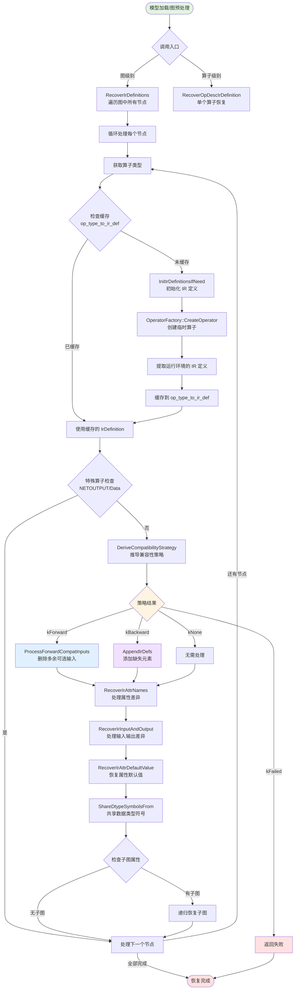
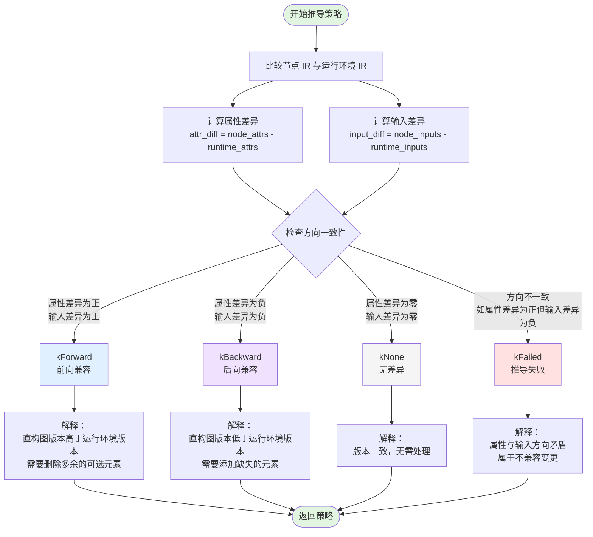
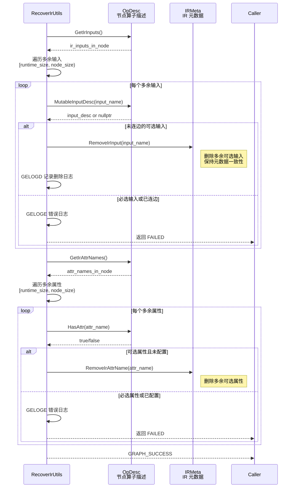
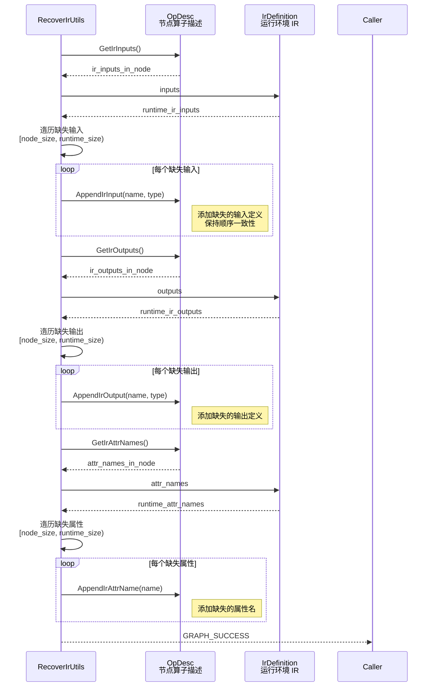
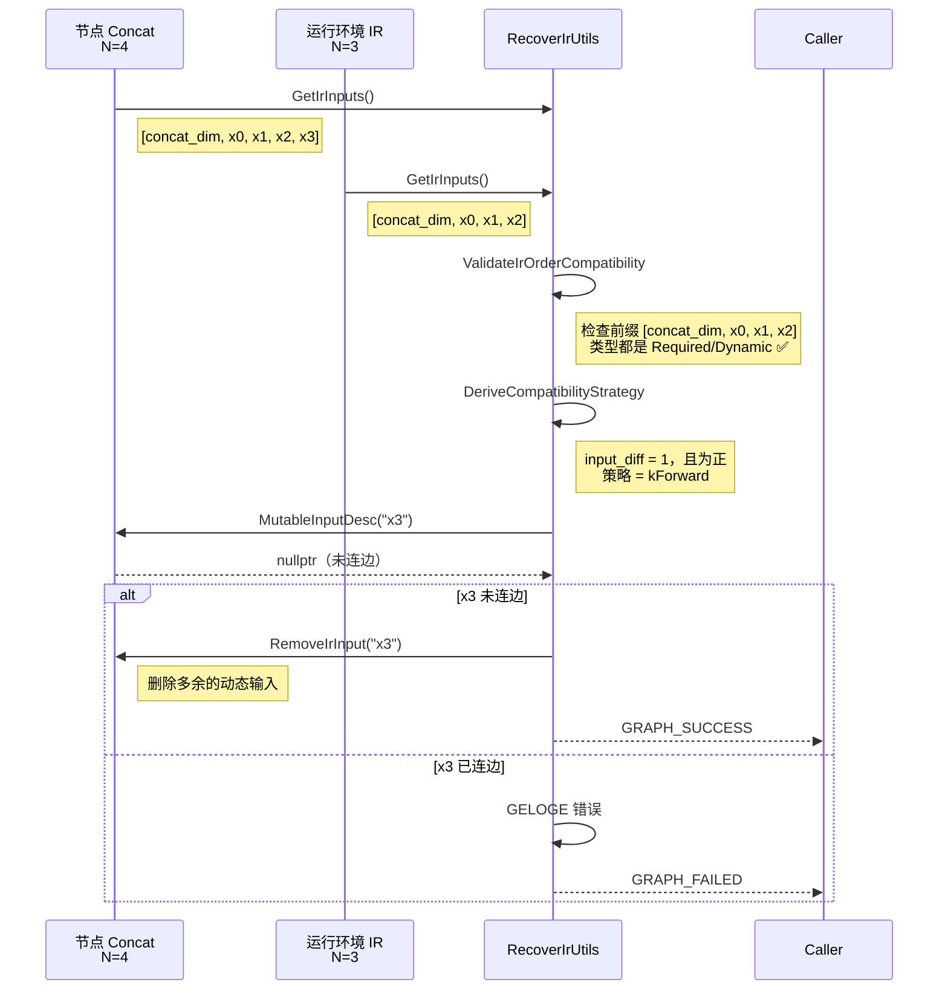

# GE 图引擎 IR 恢复流程分析

## 一、问题背景：为什么需要 IR 恢复？

GE 图引擎面临一个独特的版本兼容性挑战：**直构图时的算子 IR 定义与运行环境的 IR 定义可能不一致**。

### 1.1 具体场景

- 用户在 CANN 8.0.RC1 环境下构图，模型中使用了 `Add` 算子的 3 个输入
- 模型部署到 CANN 8.0.RC2 环境，`Add` 算子新增了第 4 个可选输入 `bias`
- 如果不恢复 IR，运行环境会认为算子定义不完整，导致执行失败

### 1.2 现有方案的不足

- **硬编码兼容**：在算子实现中写大量版本判断逻辑，维护成本高
- **模型重编译**：要求用户在新环境下重新构图，破坏了模型的可移植性
- **忽略差异**：直接忽略新增的输入/属性，可能导致功能缺失

### 1.3 GE 的解决方案

设计一套**自动化的 IR 恢复机制**，在模型加载时动态适配版本差异，既保证兼容性，又无需用户干预。

---

## 二、设计哲学：前向兼容优先，后向兼容兜底

GE 的 IR 恢复遵循一个清晰的设计哲学：**"新环境能跑旧模型，旧环境尽量跑新模型"**。

这个哲学体现在兼容性策略的三层设计：

| 策略 | 场景 | 处理方式 | 设计动机 |
|------|------|----------|----------|
| **kForward** | 直构图 IR > 运行环境 IR | 删除多余的可选元素 | 旧环境无法支持新特性，但可选特性删掉不影响核心功能 |
| **kBackward** | 直构图 IR < 运行环境 IR | 添加缺失的元素 | 新环境有新特性，添加后能完整运行 |
| **kNone** | 版本一致 | 无需处理 | 最理想情况 |

### 2.1 关键权衡：为什么前向兼容要"删除"而不是"忽略"？

> 如果只是忽略多余的可选输入，算子的 IR 元数据会不一致——元数据说有 4 个输入，但实际只连了 3 个。这会导致后续的 shape 推导、内存分配等流程出错。删除是让元数据与实际状态保持一致的正确做法。

---

## 三、核心数据结构

### 3.1 IR 定义缓存结构

```cpp
struct IrDefinition {
  bool inited{false};                      // 是否已初始化
  bool has_ir_definition{false};           // 是否有注册的 IR
  std::vector<std::string> attr_names;     // 属性名列表
  std::map<std::string, AnyValue> attr_value; // 属性默认值
  InputIrDefs inputs;                      // 输入定义 [(name, type)]
  OutputIrDefs outputs;                    // 输出定义 [(name, type)]
  OpDescPtr op_desc{nullptr};              // 临时算子实例
  std::vector<uint8_t> is_required_attr;   // 属性是否必选
  CompatibilityStrategy strategy;          // 兼容性策略
};
```

### 3.2 兼容性策略枚举

```cpp
enum class CompatibilityStrategy {
  kForward,   // 前向兼容：直构图 IR 版本 > 运行环境 IR 版本
  kBackward,  // 后向兼容：直构图 IR 版本 < 运行环境 IR 版本
  kNone,      // 无差异：版本一致
  kFailed     // 推导失败：属性与输入方向不一致
};
```

### 3.3 设计亮点

- `IrDefinition` 作为**缓存单元**，同类型算子共享一份，避免重复创建临时算子
- `strategy` 字段记录推导结果，后续处理流程据此分支
- `is_required_attr` 数组区分必选/可选属性，前向兼容时只删可选

---

## 四、核心流程

### 4.1 整体流程架构



### 4.2 兼容性策略推导流程



### 4.3 前向兼容处理流程（删除多余元素）



### 4.4 后向兼容处理流程（添加缺失元素）



---

## 五、关键设计决策

### 5.1 为什么用临时算子获取 IR 定义？

**决策**：通过 `OperatorFactory::CreateOperator` 创建临时算子实例，从中提取 IR 定义。

**替代方案**：
1. **直接读取算子注册表**：更直接，但注册表可能不包含完整的 IR 元数据
2. **硬编码 IR 定义**：维护成本高，每次算子更新都要改代码

**权衡分析**：
- 临时算子方案能获取**完整的 IR 元数据**（包括默认值、类型信息）
- 代价是创建算子实例有开销，但通过缓存机制（`op_type_to_ir_def`） amortize 了成本
- 对于没有注册 IR 的算子（如 FrameworkOp），优雅降级为跳过恢复

**代码依据**：`ir_definitions_recover.cc:252-275`

### 5.2 为什么前向兼容要删除而不是忽略？

**决策**：前向兼容时，删除多余的可选输入/属性，而不是保留但忽略。

**替代方案**：
1. **保留但不处理**：元数据不一致，后续流程（shape 推导、内存分配）会出错
2. **标记为"已忽略"**：增加复杂度，需要额外的状态管理

**权衡分析**：
- 删除保证了**元数据与实际状态的一致性**，这是 GE 架构的基础假设
- 只删除可选且未连边/未配置的元素，不影响核心功能
- 必选元素或已连边元素存在差异时，判定为不兼容并报错，避免运行时崩溃

**代码依据**：`ir_definitions_recover.cc:172-203`

### 5.3 为什么输出总是向后兼容？

**决策**：输出处理不区分前向/后向，总是添加缺失的输出（如果运行环境有更多输出）。

**设计动机**：
- 输出是算子的"产品"，新增输出不影响已有输出的语义
- 输出不需要"连边"检查——输出是算子自己产生的，不是外部提供的
- 前向兼容场景下，节点输出数不可能大于运行环境输出数（否则推导失败）

**代码依据**：`ir_definitions_recover.cc:384-391`

### 5.4 为什么属性和输入方向必须一致？

**决策**：如果属性差异和输入差异方向不一致（如属性多了但输入少了），判定为 `kFailed`。

**设计动机**：
- 方向不一致意味着算子发生了**不兼容的结构性变更**
- 例如：新增了必选属性，但删除了必选输入——这种变更无法通过简单的增删元素来适配
- 强制一致性检查，避免运行时出现更严重的错误

**代码依据**：`ir_definitions_recover.cc:299-328`

---

## 六、模块间协作关系

### 6.1 协作模式分析

- **OperatorFactory**：负责创建临时算子，提供运行环境的 IR 定义
- **OpDesc/IRMeta**：被修改的主体，RecoverIrUtils 作为友元类直接操作其内部状态
- **缓存机制**：`op_type_to_ir_def` 在图级别恢复时共享，避免重复创建临时算子
- **递归处理**：子图属性（如 `kUbOriginGraphAttrKey`）触发递归恢复，保证嵌套图的兼容性

---

## 七、业界对比与设计洞察

### 7.1 与其他框架的兼容性方案对比

| 框架 | 兼容性方案 | 设计哲学 | 优缺点 |
|------|----------|----------|--------|
| **TensorFlow** | 版本号检查 + Op 版本注册表 | 显式版本管理 | 优点：精确控制；缺点：维护成本高 |
| **PyTorch** | JIT 编译时重新推导 | 动态适配 | 优点：灵活；缺点：性能开销 |
| **ONNX Runtime** | Opset 版本 + 兼容性层 | 标准化版本 | 优点：跨框架；缺点：依赖标准演进 |
| **GE** | IR 恢复 + 兼容性策略推导 | 自动化适配 | 优点：无需用户干预；缺点：推导逻辑复杂 |

### 7.2 GE 的独特之处

- 不依赖显式的版本号，而是通过**比较 IR 定义差异**自动推导策略
- 前向兼容设计（删除多余可选元素）是其他框架少见的做法

### 7.3 如果重新设计，可能的改进方向

1. **引入版本号语义**：
   - 当前方案完全依赖 IR 定义比较，无法区分"新增可选输入"和"新增必选输入"的版本差异
   - 如果算子注册时携带版本号，可以更精确地判断兼容性

2. **支持部分前向兼容**：
   - 当前方案对必选元素差异直接报错，可以考虑提供"降级运行"选项
   - 例如：新增的必选输入有默认值时，允许前向兼容运行

3. **增强可观测性**：
   - 当前只有日志记录，可以增加恢复统计（多少算子前向兼容、多少后向兼容）
   - 帮助用户了解模型的版本适配情况

---

## 八、亮点与问题

### 8.1 亮点

1. **自动化程度高**：用户无需关心版本差异，系统自动适配
2. **缓存机制高效**：同类型算子共享 IR 定义，避免重复开销
3. **设计哲学清晰**：前向兼容优先，后向兼容兜底，策略推导有明确规则
4. **元数据一致性保证**：删除多余元素而非忽略，避免后续流程出错

### 8.2 问题

1. **推导逻辑复杂**：属性和输入方向一致性检查增加了理解难度
2. **缺少版本号语义**：无法区分"可选新增"和"必选新增"的版本差异
3. **错误处理不够友好**：兼容性失败时只报错，不提供降级选项
4. **可观测性不足**：缺少恢复统计，用户难以了解适配情况

---

## 九、总结与启发

### 9.1 核心启发

- **元数据一致性是架构的基础假设**：删除多余元素而非忽略，体现了对一致性的重视
- **自动化适配需要明确的规则**：兼容性策略的三层设计（前向/后向/无差异）提供了清晰的决策框架
- **缓存是 amortize 开销的关键**：临时算子创建有成本，但通过缓存让成本可接受

### 9.2 适用场景

- 需要支持模型跨版本部署的框架
- 算子定义可能随版本演进的系统
- 希望减少用户版本管理负担的场景

---

## 十、调用入口汇总

| 调用位置 | 文件路径 | 调用场景 |
|---------|---------|---------|
| 图预处理 | `compiler/graph/preprocess/graph_prepare.cc:2390` | 图编译前的预处理阶段 |
| RT2 模型转换 | `runtime/v2/lowering/model_converter.cc:552` | RT2 运行时模型转换 |
| Hybrid 模型构建 | `runtime/v1/hybrid/model/hybrid_model_builder.cc:1067` | Hybrid 执行器模型构建 |
| 图管理器 | `compiler/graph/manager/graph_manager.cc:4190` | 图管理器统一入口 |
| 算子 Tiling | `base/common/op_tiling/op_tiling_rt2.cc:844` | RT2 算子 Tiling 阶段 |
| 图重写 | `compiler/graph/fusion/graph_rewriter.cc:255` | 图融合重写后恢复 IR |
| GE 工具函数 | `compiler/graph/common/ge_utils.cc:73` | GE 通用工具函数 |
| FE 图优化 | `compiler/engines/nn_engine/optimizer/graph_optimizer/fe_graph_optimizer.cc:1857` | FE 图优化器 |

---

## 十一、动态输入的处理机制

### 11.1 IR 输入类型定义

GE 的 IR 输入分为三种类型，每种类型在恢复时有不同的处理规则：

```cpp
enum IrInputType {
  kIrInputRequired,   // 必选输入：必须存在且必须连边
  kIrInputOptional,   // 可选输入：可以存在但不一定连边
  kIrInputDynamic,    // 动态输入：数量可变（如 Concat 的多个输入）
};
```

### 11.2 动态输入的典型案例：Concat 算子

```cpp
REG_OP(Concat)
    .INPUT(concat_dim, TensorType::IndexNumberType())      // 必选输入，固定位置
    .DYNAMIC_INPUT(x, TensorType::BasicType())             // 动态输入，数量可变
    .OUTPUT(y, TensorType::BasicType())
    .ATTR(N, Int, 1)
```

**IR 定义解读**：
- `concat_dim`：必选输入，位置固定在第 0 位
- `x`：动态输入，可以有多个（如 `x0`, `x1`, `x2`...），数量由属性 `N` 决定
- `N`：属性，记录动态输入的实际数量

### 11.3 动态输入的处理规则

#### 规则一：顺序兼容性检查（强制）

```cpp
// ir_definitions_recover.cc:129-139
template <typename IrDef>
bool ValidateIrOrderCompatibility(const IrDef &node_ir_defs, const IrDef &compatible_ir_defs) {
  const size_t min_size = std::min(node_ir_defs.size(), compatible_ir_defs.size());
  for (size_t i = 0U; i < min_size; ++i) {
    if (node_ir_defs[i] != compatible_ir_defs[i]) {
      return false;  // 前缀部分必须完全一致
    }
  }
  return true;
}
```

**含义**：动态输入的数量可以不同，但**前缀部分必须一致**。

#### 规则二：动态输入的数量检查

```cpp
// ir_definitions_recover.cc:451-458
bool ir_input_include_dynamic = false;
for (auto &ir_def_input : ir_def.inputs) {
  if ((ir_def_input.second == kIrInputDynamic) || 
      (ir_def_input.second == kIrInputOptional)) {
    ir_input_include_dynamic = true;
    break;
  }
}

// 如果包含动态输入，则输入数量可以不匹配
if ((input_num != ir_def.inputs.size()) && !ir_input_include_dynamic) {
  return false;  // 不包含动态输入时，数量必须完全匹配
}
```

### 11.4 Concat 算子的具体恢复场景

#### 场景一：前向兼容（节点有更多动态输入）

```
节点 IR（CANN 8.0.RC2）：
  - concat_dim (Required)
  - x0 (Dynamic)
  - x1 (Dynamic)
  - x2 (Dynamic)
  - x3 (Dynamic)  ← 多了一个

运行环境 IR（CANN 8.0.RC1）：
  - concat_dim (Required)
  - x0 (Dynamic)
  - x1 (Dynamic)
  - x2 (Dynamic)
```

**处理方式**：
- 检查前缀：`concat_dim` 一致，`x0/x1/x2` 类型一致（都是 Dynamic）✅
- 推导策略：`kForward`（节点输入数 > 运行环境输入数）
- **关键判断**：检查 `x3` 是否已连边
  - 如果 `x3` 未连边 → 删除该输入，恢复成功
  - 如果 `x3` 已连边 → 报错失败（旧环境无法处理这个输入）

#### 场景二：后向兼容（节点有更少动态输入）

```
节点 IR（CANN 8.0.RC1）：
  - concat_dim (Required)
  - x0 (Dynamic)
  - x1 (Dynamic)

运行环境 IR（CANN 8.0.RC2）：
  - concat_dim (Required)
  - x0 (Dynamic)
  - x1 (Dynamic)
  - x2 (Dynamic)  ← 多了一个
```

**处理方式**：
- 检查前缀：`concat_dim` 一致，`x0/x1` 类型一致 ✅
- 推导策略：`kBackward`（节点输入数 < 运行环境输入数）
- 添加缺失的 `x2` 输入定义，恢复成功

#### 场景三：必选输入差异（失败）

```
节点 IR：
  - concat_dim_v2 (Required)  ← 名称或类型不同
  - x0 (Dynamic)

运行环境 IR：
  - concat_dim (Required)
  - x0 (Dynamic)
```

**处理方式**：
- 检查前缀：第 0 位输入不一致（`concat_dim_v2` vs `concat_dim`）
- **直接失败**，无法恢复

### 11.5 什么样的 IR 可以被恢复？

#### 可以恢复的情况

| 场景 | 条件 | 处理方式 |
|------|------|----------|
| **动态输入数量差异** | 前缀一致，多余输入未连边 | 删除多余输入（前向）或添加缺失输入（后向） |
| **可选输入差异** | 多余可选输入未连边 | 删除多余可选输入 |
| **可选属性差异** | 多余可选属性未配置 | 删除多余可选属性 |
| **输出数量差异** | 节点输出 ≤ 运行环境输出 | 添加缺失输出 |

#### 不能恢复的情况

| 场景 | 原因 | 代码依据 |
|------|------|----------|
| **必选输入差异** | 必选输入必须存在且连边 | `ir_definitions_recover.cc:182-187` |
| **已连边的多余输入** | 实际使用了新特性，旧环境不支持 | `ir_definitions_recover.cc:190-194` |
| **已配置的多余属性** | 实际使用了新特性 | `ir_definitions_recover.cc:226-229` |
| **前缀顺序不一致** | 破坏了 IR 的基本结构 | `ir_definitions_recover.cc:147-152` |
| **属性与输入方向矛盾** | 不兼容的结构性变更 | `ir_definitions_recover.cc:312-320` |

### 11.6 动态输入的特殊性

**关键洞察**：动态输入的数量差异**不触发兼容性策略推导**。

```cpp
// ir_definitions_recover.cc:301-328
int64_t input_diff = static_cast<int64_t>(desc->GetIrInputs().size()) - 
                     static_cast<int64_t>(ir_def.inputs.size());

// 只有当 input_diff != 0 时才参与策略推导
// 但动态输入的数量差异在 CheckIrSpec 中已经允许了
```

**实际行为**：
- 动态输入的数量差异在 `CheckIrSpec` 检查时就被允许了（不判定为不匹配）
- 只有当**必选输入**的数量或顺序发生变化时，才会触发兼容性策略推导

### 11.7 Concat 算子的完整恢复流程示例



### 11.8 动态输入处理的核心原则

**总结**：

1. **数量可变，顺序不变**：动态输入的数量可以不同，但前缀部分必须完全一致
2. **前向兼容需检查连边**：多余的动态输入如果已连边，则无法恢复（实际使用了新特性）
3. **后向兼容直接添加**：缺失的动态输入直接添加定义即可
4. **不触发策略推导**：动态输入的数量差异在规格检查时就被允许，不参与兼容性策略推导

**Concat 算子的恢复条件**：
- `concat_dim` 必选输入必须一致
- 动态输入 `x` 的数量可以不同，但已有的 `x0/x1...` 类型必须一致
- 多余的动态输入如果未连边，可以删除；如果已连边，则失败

---

**分析日期**：2026-05-05  
**分析工具**：repo-analyzer skill  
**代码版本**：GE trunk_ai/ge
