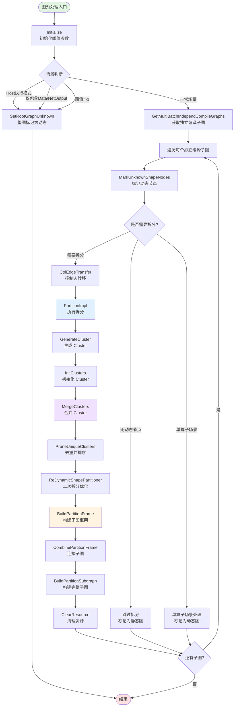
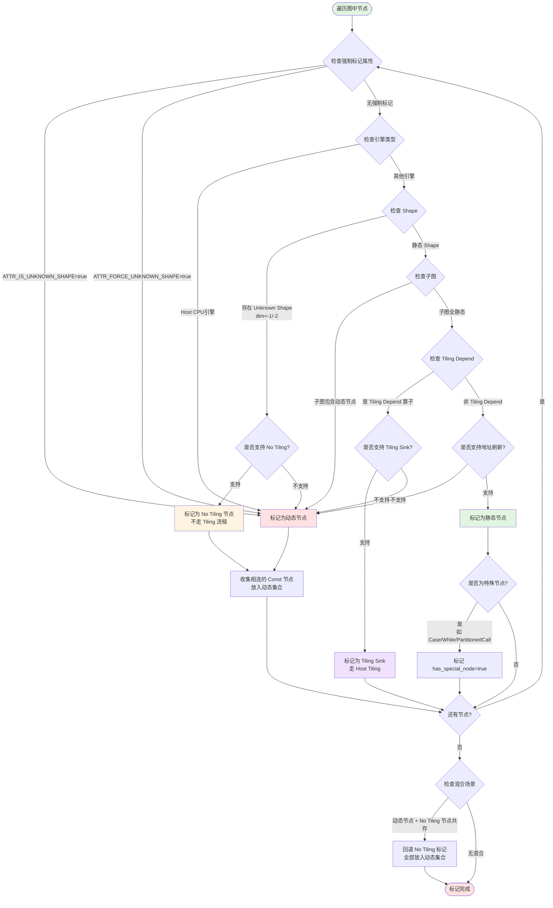
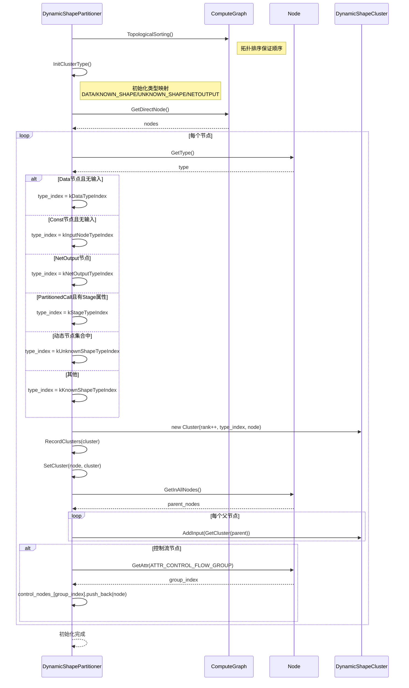
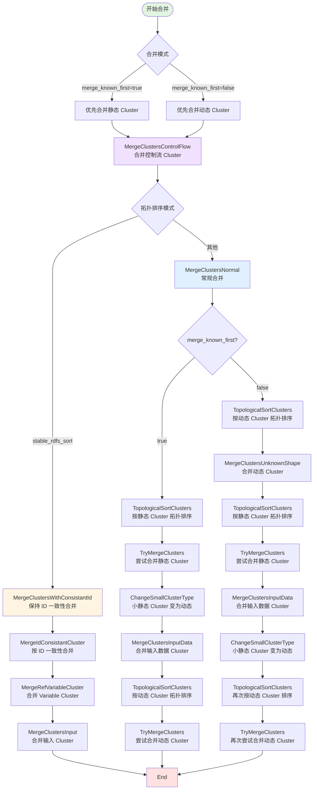
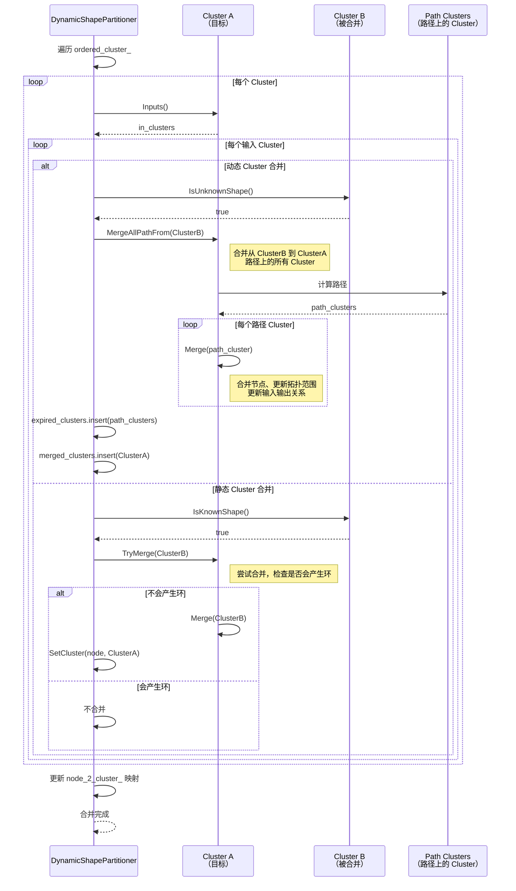
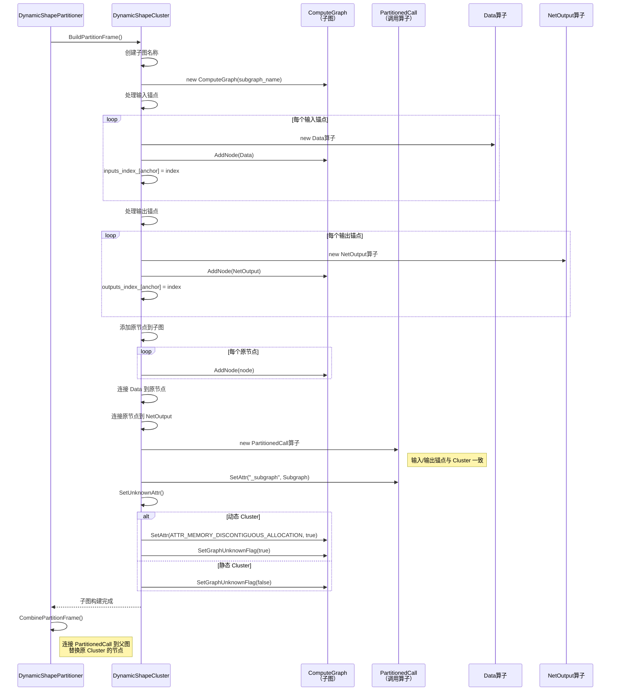
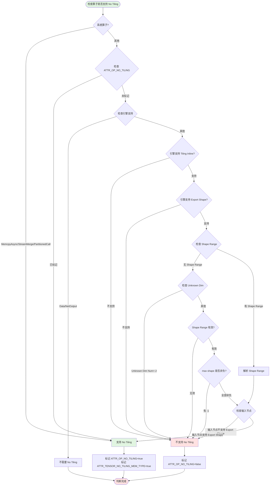
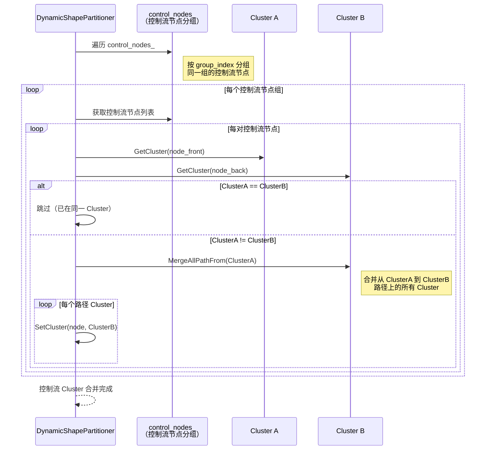

# GE 图引擎动态图拆分模块分析

## 一、问题背景：为什么需要动态图拆分？

GE 图引擎面临一个根本性的架构挑战：**如何在一张图中同时处理静态 shape 算子和动态 shape 算子？**

### 1.1 具体场景

**典型问题场景**：
- 用户模型中包含动态 shape 算子（如 `Reshape`、`Broadcast`），其输入/输出 shape 在编译时未知（dim=-1）
- 同时模型中也有大量静态 shape 算子（如 `Conv2D`、`MatMul`），其 shape 在编译时已确定
- 如果不拆分，整个图会被标记为"动态图"，导致：
  - 静态算子无法享受静态图优化（如内存复用、算子融合）
  - 动态算子无法享受动态图特性（如 shape 推导、流式执行）
  - 整体性能严重下降

### 1.2 现有方案的不足

| 方案 | 问题 |
|------|------|
| **全静态图** | 动态算子无法执行，shape 推导失败 |
| **全动态图** | 静态算子性能损失，无法做深度优化 |
| **用户手动拆分** | 用户负担重，破坏模型可移植性 |
| **算子级别动态调度** | 调度开销大，无法做跨算子优化 |

### 1.3 GE 的解决方案

设计一套**自动化的动态图拆分机制**，将一张混合图拆分成多个子图：
- **静态子图**：包含静态 shape 算子，享受静态图优化
- **动态子图**：包含动态 shape 算子，享受动态图特性
- **自动连接**：通过 `PartitionedCall` 算子自动连接子图，保证数据流正确

**核心价值**：用户无需关心拆分细节，系统自动适配，既保证兼容性，又最大化性能。

---

## 二、设计哲学：动静分离，最优调度

GE 的动态图拆分遵循一个清晰的设计哲学：**"静态算子走静态路，动态算子走动态路，自动连接不丢数据"**。

这个哲学体现在三个核心原则：

### 2.1 原则一：最小化动态子图

**动机**：动态子图的调度开销大，应尽量减少。

**实现**：
- 只将真正需要动态 shape 的算子放入动态子图
- 静态算子尽量合并到静态子图，即使与动态算子相邻
- 小静态子图（<阈值）会被合并到动态子图，避免碎片化

**代码依据**：`dynamic_shape_partition.cc:774-791`（`ChangeSmallClusterType`）

### 2.2 原则二：最大化静态子图优化

**动机**：静态子图可以做深度优化（内存复用、算子融合），应尽量放大。

**实现**：
- 静态算子优先合并到静态子图
- 静态子图可以跨多个动态算子（通过 `PartitionedCall` 连接）
- 静态子图内部可以做完整的图优化

**代码依据**：`dynamic_shape_partition.cc:912-963`（`MergeClustersNormal`）

### 2.3 原则三：保证数据流正确性

**动机**：拆分后数据流不能断，必须保证输入输出正确。

**实现**：
- 每个 Cluster 对应一个 `PartitionedCall` 算子
- `PartitionedCall` 的输入/输出锚点与原 Cluster 的输入/输出锚点一致
- 子图内部通过 `Data` 和 `NetOutput` 算子连接

**代码依据**：`base_cluster.cc:BuildFrame`、`CombinePartitionFrame`

---

## 三、核心数据结构

### 3.1 Cluster：拆分的基本单元

```cpp
class BaseCluster : public std::enable_shared_from_this<BaseCluster> {
  int32_t type_index_;          // Cluster 类型（DATA/KNOWN_SHAPE/UNKNOWN_SHAPE/NETOUTPUT）
  size_t id_;                   // Cluster ID（拓扑排序位置）
  size_t min_;                  // Cluster 内节点的最小拓扑序
  size_t max_;                  // Cluster 内节点的最大拓扑序
  std::vector<BaseCluster *> in_clusters_;   // 输入 Cluster
  std::vector<BaseCluster *> out_clusters_;  // 输出 Cluster
  std::vector<NodePtr> nodes_;              // Cluster 包含的节点
  ComputeGraphPtr subgraph_;                // 对应的子图
  NodePtr partition_node_;                  // 对应的 PartitionedCall 算子
};
```

**设计亮点**：
- `min_` 和 `max_` 记录拓扑范围，用于判断是否可以合并（避免环）
- `in_clusters_` 和 `out_clusters_` 记录 Cluster 间的连接关系
- `subgraph_` 和 `partition_node_` 是拆分后的产物

### 3.2 DynamicShapeCluster：动态图拆分的特化

```cpp
class DynamicShapeCluster : public BaseCluster {
  bool IsKnownShape() const;     // 是否为静态 Cluster
  bool IsUnknownShape() const;   // 是否为动态 Cluster
  Status SetUnknownAttr();       // 设置动态属性（内存不连续等）
  void Merge(std::shared_ptr<BaseCluster> other) override;  // 合并时更新类型
};
```

**关键行为**：
- 合并时，如果被合并的 Cluster 是动态类型，当前 Cluster 也会变为动态类型
- 动态 Cluster 的子图会被标记为"内存不连续分配"（`ATTR_NAME_MEMORY_DISCONTIGUOUS_ALLOCATION`）

### 3.3 DynamicShapePartitioner：拆分的主控制器

```cpp
class DynamicShapePartitioner : public BasePartitioner {
  std::unordered_set<NodePtr> known_shape_nodes_;           // 静态节点集合
  std::unordered_set<NodePtr> unknown_shape_nodes_;         // 动态节点集合
  std::unordered_set<NodePtr> unknown_shape_no_tiling_nodes_; // 支持 No Tiling 的动态节点
  int64_t static_model_ops_lower_limit_;                    // 静态子图最小算子数阈值
  bool merge_known_first_;                                  // 是否优先合并静态 Cluster
};
```

**核心职责**：
- 标记动态节点（`MarkUnknownShapeNodes`）
- 初始化 Cluster（`InitClusters`）
- 合并 Cluster（`MergeClusters`）
- 构建子图（`BuildPartitionFrame`）

---

## 四、核心流程

### 4.1 整体流程架构



### 4.2 动态节点标记流程



### 4.3 Cluster 初始化流程



### 4.4 Cluster 合并流程（核心）



### 4.5 Cluster 合并的详细逻辑



### 4.6 子图构建流程



---

## 五、关键设计决策

### 5.1 为什么用 Cluster 作为拆分单元？

**决策**：用 Cluster（一组节点）作为拆分的基本单元，而不是单个节点。

**替代方案**：
1. **节点级别拆分**：每个节点一个子图，调度开销大
2. **算子类型拆分**：按算子类型拆分，无法处理混合场景
3. **用户手动拆分**：用户负担重，破坏可移植性

**权衡分析**：
- Cluster 可以**最大化子图大小**，减少调度开销
- Cluster 内部可以做**跨算子优化**（如算子融合、内存复用）
- Cluster 的合并逻辑可以**动态调整**，适应不同场景
- 代价是 Cluster 的合并逻辑复杂，需要处理环检测、拓扑排序等

**代码依据**：`base_cluster.h:76-191`

### 5.2 为什么动态 Cluster 合并要"合并路径"？

**决策**：合并动态 Cluster 时，不是简单合并两个 Cluster，而是合并路径上的所有 Cluster。

**示例**：
```
ClusterA (动态) -> ClusterB (静态) -> ClusterC (静态) -> ClusterD (动态)
```
合并 ClusterA 和 ClusterD 时，会合并 ClusterB 和 ClusterC。

**设计动机**：
- 动态 Cluster 之间的静态 Cluster 如果不合并，会导致**数据流断裂**
- 静态 Cluster 在动态路径上无法独立执行（需要动态 shape 输入）
- 合并路径保证了**数据流的连续性**

**代码依据**：`dynamic_shape_partition.cc:687-721`（`MergeClustersUnknownShape`）

### 5.3 为什么静态 Cluster 合并要"尝试合并"？

**决策**：合并静态 Cluster 时，使用 `TryMerge`，检查是否会产生环。

**设计动机**：
- 静态 Cluster 合并可能产生环（如 A->B->C，合并 A 和 C 会产生环）
- 环会导致**拓扑排序失败**，无法构建子图
- `TryMerge` 通过检查 `min_` 和 `max_` 来判断是否会产生环

**环检测逻辑**：
```cpp
bool TryMerge(std::shared_ptr<BaseCluster> other) {
  // 如果 other 的拓扑范围在当前 Cluster 内，会产生环
  if ((other->MinId() >= min_) && (other->MaxId() <= max_)) {
    return false;  // 会产生环，不合并
  }
  Merge(other);
  return true;
}
```

**代码依据**：`base_cluster.cc:TryMerge`

### 5.4 为什么小静态 Cluster 要变为动态 Cluster？

**决策**：静态 Cluster 的节点数小于阈值（默认 4）时，强制变为动态 Cluster。

**设计动机**：
- 小静态子图会**占用流资源**（每个子图需要一个流）
- 小静态子图会导致**动态子图碎片化**（动态子图被分割成多段）
- 合并到动态子图可以**保证动态子图的连续性**

**权衡分析**：
- 优点：减少流资源占用，保证动态子图连续性
- 缺点：静态算子失去静态优化机会
- 阈值可配置（`OPTION_STATIC_MODEL_OPS_LOWER_LIMIT`），用户可以调整

**代码依据**：`dynamic_shape_partition.cc:774-791`（`ChangeSmallClusterType`）

### 5.5 为什么支持 No Tiling 机制？

**决策**：动态 shape 算子如果支持 No Tiling，可以不走 Tiling 流程，直接执行。

**设计动机**：
- Tiling 流程需要**Host 计算**，开销大
- 某些动态算子（如 `MemcpyAsync`）不需要 Tiling，可以直接执行
- No Tiling 可以**减少 Host 开销**，提升性能

**No Tiling 的条件**：
1. 算子引擎支持 Tiling Inline（在 Device 上执行 Tiling）
2. 算子引擎支持 Export Shape（执行后更新 shape）
3. 输入节点的引擎也支持 Export Shape
4. Shape Range 有效（max shape >= 0）

**代码依据**：`dynamic_shape_partition.cc:1018-1099`（`IsNodeSupportNoTiling`）

---

## 六、模块间协作关系

### 6.1 协作模式分析

- **ComputeGraph**：原图，包含所有节点和连接关系
- **Cluster**：拆分的基本单元，一组节点
- **PartitionedCall**：拆分后的产物，调用子图的算子
- **Subgraph**：拆分后的子图，包含 Cluster 内的节点
- **PartitionerPass**：二次拆分优化，如 `DynamicDataFlowPartitionerPass`

---

## 七、业界对比与设计洞察

### 7.1 与其他框架的动态图处理对比

| 框架 | 动态图处理方案 | 设计哲学 | 优缺点 |
|------|--------------|----------|--------|
| **TensorFlow** | 动态 shape 算子走动态执行，静态算子走静态执行 | 算子级别动态调度 | 优点：简单；缺点：调度开销大 |
| **PyTorch** | JIT 编译时重新推导 shape | 动态推导 | 优点：灵活；缺点：编译开销大 |
| **ONNX Runtime** | 动态 shape 算子走动态执行路径 | 算子级别动态调度 | 优点：跨框架；缺点：无法做跨算子优化 |
| **GE** | 动态图拆分 + Cluster 合并 | 子图级别动态调度 | 优点：最大化静态优化；缺点：拆分逻辑复杂 |

### 7.2 GE 的独特之处

- **Cluster 抽象**：用 Cluster 作为拆分单元，而不是节点
- **路径合并**：动态 Cluster 合并时合并路径，保证数据流连续性
- **No Tiling 机制**：支持动态算子不走 Tiling，减少 Host 开销
- **二次拆分优化**：通过 PartitionerPass 进行二次优化

### 7.3 如果重新设计，可能的改进方向

1. **引入更智能的合并策略**：
   - 当前合并策略基于拓扑排序和类型，可以引入**性能预估模型**
   - 根据算子执行时间、内存占用等预估子图性能，优化合并策略

2. **支持跨子图优化**：
   - 当前子图内部可以做优化，但跨子图无法优化
   - 可以引入**跨子图算子融合**，如将 PartitionedCall 前后的算子融合

3. **增强 No Tiling 支持**：
   - 当前 No Tiling 只支持部分算子，可以扩展到更多算子
   - 可以引入**自动 No Tiling 判断**，根据算子特性自动决定是否走 No Tiling

4. **支持动态子图缓存**：
   - 动态子图的执行开销大，可以引入**子图缓存机制**
   - 根据 shape range 缓存不同 shape 的子图执行结果

---

## 八、亮点与问题

### 8.1 亮点

1. **自动化程度高**：用户无需关心拆分细节，系统自动适配
2. **Cluster 抽象精妙**：用 Cluster 作为拆分单元，最大化子图大小
3. **路径合并保证连续性**：动态 Cluster 合并时合并路径，避免数据流断裂
4. **No Tiling 机制创新**：支持动态算子不走 Tiling，减少 Host 开销
5. **二次拆分优化**：通过 PartitionerPass 进行二次优化，提升性能

### 8.2 问题

1. **合并逻辑复杂**：多种合并策略（前向、后向、控制流），理解难度大
2. **环检测开销大**：`TryMerge` 需要检查拓扑范围，大规模图时开销大
3. **阈值配置不灵活**：静态子图阈值固定，无法根据场景动态调整
4. **No Tiling 支持有限**：只支持部分算子，无法覆盖所有动态算子
5. **缺少性能预估**：合并策略基于拓扑，缺少性能预估模型

---

## 九、总结与启发

### 9.1 核心启发

- **Cluster 是拆分的基本单元**：用 Cluster 而不是节点，最大化子图大小
- **路径合并保证连续性**：动态 Cluster 合并时合并路径，避免数据流断裂
- **No Tiling 减少开销**：支持动态算子不走 Tiling，减少 Host 开销
- **二次优化提升性能**：通过 PartitionerPass 进行二次优化，提升性能

### 9.2 适用场景

- 需要处理动态 shape 算子的框架
- 需要最大化静态算子优化的系统
- 需要减少动态算子调度开销的场景

---

## 十、调用入口汇总

| 调用位置 | 文件路径 | 调用场景 |
|---------|---------|---------|
| 图预处理 | `compiler/graph/preprocess/graph_prepare.cc` | 图编译前的预处理阶段 |
| 图管理器 | `compiler/graph/manager/graph_manager.cc` | 图管理器统一入口 |
| FE 图优化 | `compiler/engines/nn_engine/optimizer/graph_optimizer/fe_graph_optimizer.cc` | FE 图优化器 |

---

## 十一、No Tiling 机制详解

### 11.1 No Tiling 的核心思想

**问题**：动态 shape 算子通常需要 Tiling 流程（Host 计算 shape，Device 执行算子），开销大。

**解决方案**：如果算子支持 No Tiling，可以：
1. **在 Device 上执行 Tiling**（Tiling Inline）
2. **执行后更新 shape**（Export Shape）
3. **减少 Host 开销**，提升性能

### 11.2 No Tiling 的判断流程



### 11.3 No Tiling 的实现细节

**关键属性**：
- `ATTR_NAME_OP_NO_TILING`：算子是否支持 No Tiling
- `ATTR_NAME_TENSOR_NO_TILING_MEM_TYPE`：Tensor 是否走 No Tiling 内存类型
- `ATTR_NAME_OP_MAX_SHAPE`：算子的最大 shape（用于 shape range）
- `ATTR_NAME_TENSOR_MAX_SHAPE`：Tensor 的最大 shape

**执行流程**：
1. 编译时标记 No Tiling 属性
2. 执行时，如果算子支持 No Tiling：
   - 不走 Host Tiling 流程
   - 在 Device 上执行 Tiling Inline
   - 执行后更新 shape（Export Shape）

**代码依据**：`dynamic_shape_partition.cc:1119-1165`（`MarkOpNoTiling`）

---

## 十二、控制流 Cluster 的特殊处理

### 12.1 控制流算子的特殊性

**控制流算子**：`Case`、`While`、`If`、`PartitionedCall` 等，包含子图。

**特殊性**：
- 控制流算子的子图可能包含动态节点
- 控制流算子本身可能是静态的（子图全静态）
- 控制流算子的合并需要特殊处理

### 12.2 控制流 Cluster 的合并逻辑



**设计动机**：
- 控制流节点需要**在同一 Cluster**，保证控制流的正确性
- 同一 `group_index` 的控制流节点属于同一控制流结构（如 Case 的多个分支）
- 合并路径保证控制流 Cluster 的连续性

**代码依据**：`dynamic_shape_partition.cc:180-201`（`MergeClustersControlFlow`）

---

**分析日期**：2026-05-07  
**分析工具**：repo-analyzer skill  
**代码版本**：GE trunk_ai/ge
