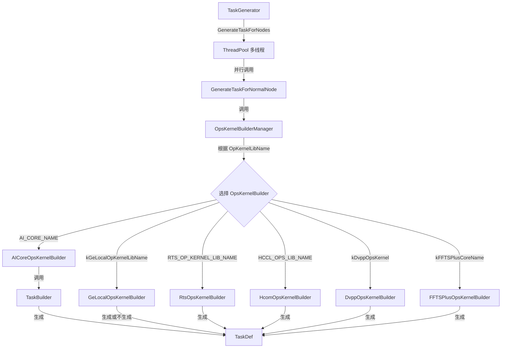
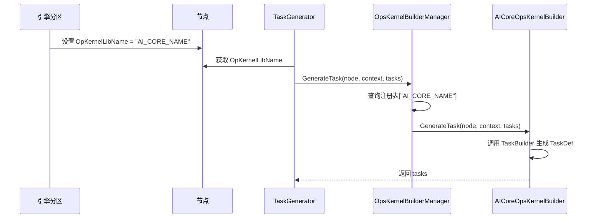
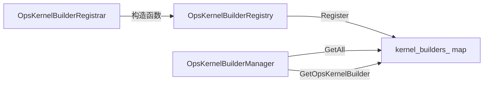
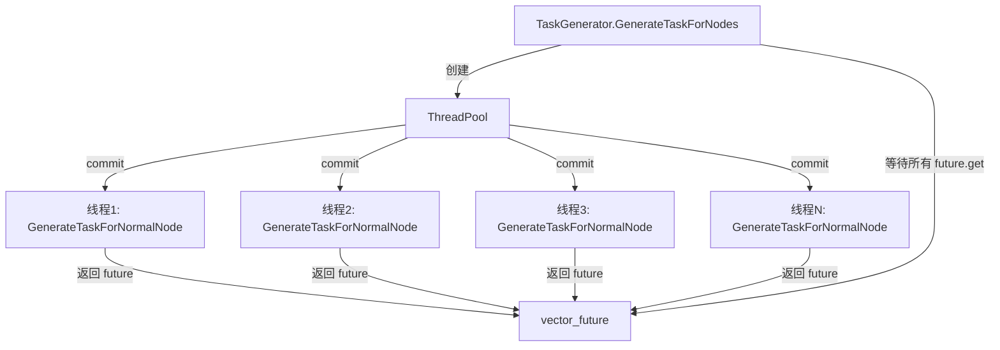
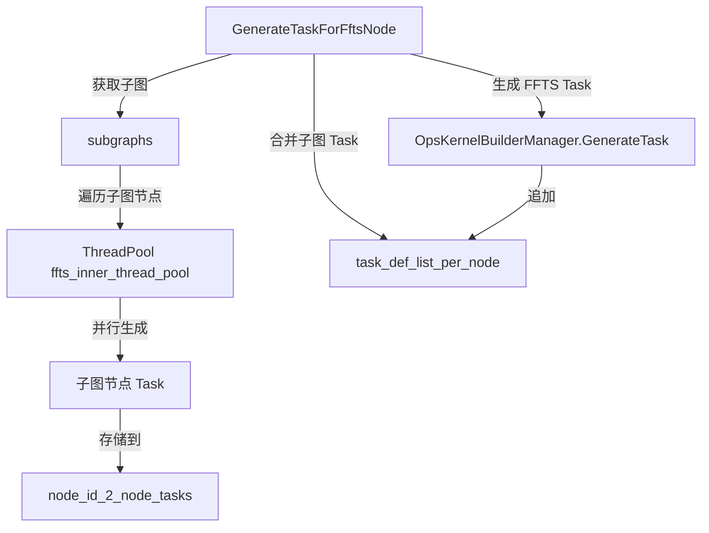
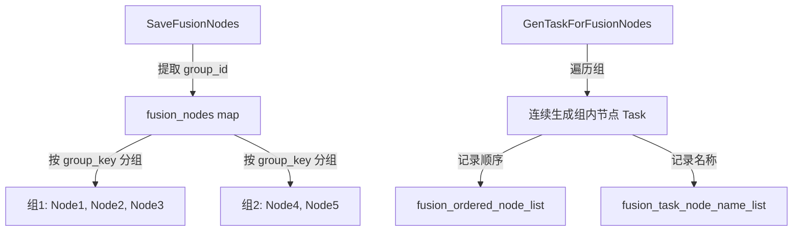
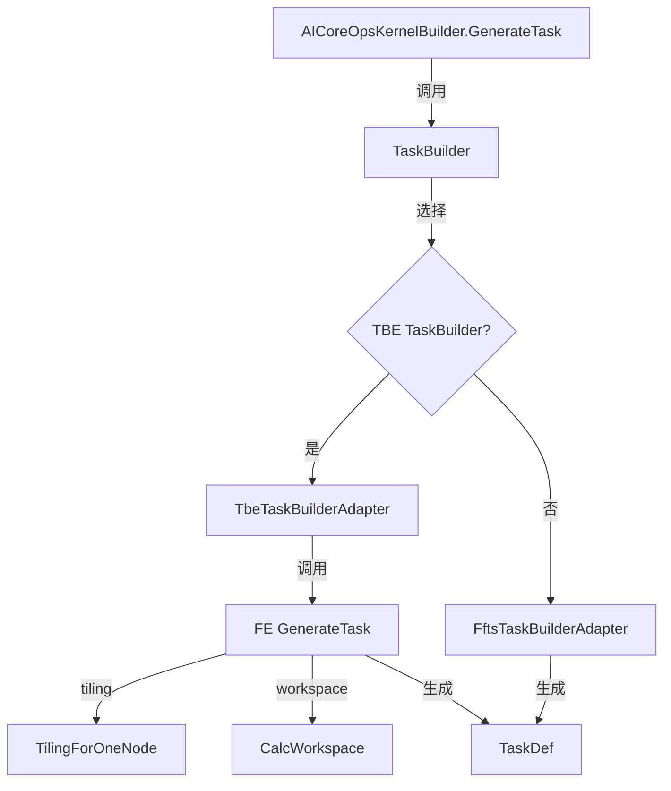

# GE GenerateTask 流程分析

## 一、场景化问题引入：为什么需要 GenerateTask？

### 1.1 核心问题：从"图"到"可执行指令"的鸿沟

GE 的图编译流程已经完成了：
- **IR恢复**：推导节点的 IR 兼容性策略
- **动态图拆分**：将动静节点分离到不同 Cluster
- **引擎分区**：将同引擎节点聚合到同一子图

但此时，图中只有"节点"（Node）和"算子描述"（OpDesc），**没有可执行的指令**。运行时需要的是：
- **Task**：具体的执行指令（如"在 Stream 0 上执行 Conv 算子，输入地址 A，输出地址 B"）
- **TaskDef**：Task 的序列化定义（包含算子类型、输入输出地址、stream_id、workspace 等）

**GenerateTask 的使命**：将"逻辑图"转换为"物理执行指令"。

### 1.2 Task 是什么？

Task 是 GE 运行时的最小执行单元。一个节点可能生成多个 Task（如 StreamSwitch 会生成多个流切换 Task），也可能不生成 Task（如某些虚拟算子）。

TaskDef 的核心字段：
- **type**：Task 类型（如 AI_CORE、AICPU、HCCL 等）
- **stream_id**：执行流 ID
- **kernel_context**：算子上下文（输入输出地址、workspace 等）
- **event_id**：同步事件 ID（可选）

### 1.3 为什么不能"一个函数搞定"？

不同引擎的 Task 生成逻辑完全不同：
- **AI Core**：需要调用 FE（Feature Engineering）生成 TBE Task，涉及 tiling、workspace 计算
- **AICPU**：需要生成 AICPU Task，调用 AICPU 接口
- **HCCL**：需要生成集合通信 Task，调用 HCCL 接口
- **GE Local**：某些算子不需要生成 Task（如 NoOp、PhonyConcat）
- **RTS**：需要生成流控制 Task（如 StreamSwitch、StreamActive）

**设计张力**：需要一个统一框架，但又要支持引擎差异化实现。

---

## 二、整体架构：三层调用链

### 2.1 调用链概览



### 2.2 三层职责划分

| 层级 | 类 | 职责 | 关键设计 |
|------|-----|------|---------|
| **协调层** | TaskGenerator | 为图中所有节点生成 Task，处理特殊场景（FFTS、融合） | 多线程并行、FFTS 子图处理、融合节点分组 |
| **管理层** | OpsKernelBuilderManager | 根据引擎名称找到对应的 OpsKernelBuilder | 单例模式、注册表查询 |
| **实现层** | OpsKernelBuilder | 各引擎实现自己的 Task 生成逻辑 | 虚函数接口、引擎差异化实现 |

---

## 三、核心设计思想

### 3.1 引擎选择机制：OpKernelLibName 作为"路由键"

**问题**：TaskGenerator 如何知道一个节点应该用哪个引擎生成 Task？

**答案**：节点的 `OpDesc` 上有一个 `OpKernelLibName` 属性，在**引擎分区阶段**就已经设置好了。



**设计洞察**：
- **提前绑定**：引擎分区阶段就确定了引擎，避免 Task 生成阶段再做复杂判断
- **属性驱动**：用节点属性作为路由键，而非运行时判断
- **解耦**：TaskGenerator 不需要知道"AI Core 是什么"，只需要知道"有个叫 AI_CORE_NAME 的引擎"

### 3.2 注册机制：插件化的引擎扩展

**问题**：如何让新引擎（如自定义算子引擎）无缝接入 GE？

**答案**：使用注册宏 `REGISTER_OPS_KERNEL_BUILDER`。

```cpp
// 各引擎通过宏注册自己的 OpsKernelBuilder
REGISTER_OPS_KERNEL_BUILDER(AI_CORE_NAME, AICoreOpsKernelBuilder);
REGISTER_OPS_KERNEL_BUILDER(kGeLocalOpKernelLibName, GeLocalOpsKernelBuilder);
REGISTER_OPS_KERNEL_BUILDER(RTS_OP_KERNEL_LIB_NAME, RtsOpsKernelBuilder);
REGISTER_OPS_KERNEL_BUILDER(HCCL_OPS_LIB_NAME, HcomOpsKernelBuilder);
REGISTER_OPS_KERNEL_BUILDER(kDvppOpsKernel, DvppOpsKernelBuilder);
REGISTER_OPS_KERNEL_BUILDER(kCustomOpKernelLibName, CustomOpsKernelBuilder);
REGISTER_OPS_KERNEL_BUILDER(kFFTSPlusCoreName, FFTSPlusOpsKernelBuilder);
```

**注册机制的核心组件**：



**设计洞察**：
- **静态注册**：编译时通过全局对象构造函数完成注册，无需运行时配置
- **单例 Registry**：OpsKernelBuilderRegistry 是单例，所有引擎共享同一个注册表
- **插件化**：新引擎只需实现 OpsKernelBuilder 接口并注册，无需修改 TaskGenerator 或 OpsKernelBuilderManager

### 3.3 多线程并行：编译速度的关键优化

**问题**：大模型可能有数千个节点，串行生成 Task 会很慢。

**答案**：TaskGenerator 使用 ThreadPool 并行生成 Task。



**关键实现细节**：
- **线程数控制**：通过环境变量 `MAX_COMPILE_CORE_NUMBER` 控制（默认 1）
- **线程安全**：每个节点的 Task 存储在独立的 `node_id_2_node_tasks_[node_id]`，避免竞争
- **异常处理**：通过 `future.get()` 捕获子线程异常

**设计权衡**：
- **优点**：大幅提升编译速度（实测可提升 3-5 倍）
- **代价**：需要处理线程同步、异常传递、资源竞争
- **替代方案**：如果线程数=1，退化为串行执行（简化调试）

### 3.4 FFTS 特殊处理：子图 Task 的嵌套生成

**问题**：FFTS（Fast Fine-Tuning Subgraph）节点内部有子图，如何生成子图节点的 Task？

**答案**：FFTS 节点有特殊的 Task 生成流程：
1. **先生成子图节点的 Task**（多线程并行）
2. **再生成 FFTS 节点本身的 Task**（封装子图 Task）



**设计洞察**：
- **嵌套并行**：FFTS 内部又创建了一个 ThreadPool（`ffts_inner_thread_pool`），实现两层并行
- **Task 合并**：子图节点的 Task 会合并到 FFTS 节点的 TaskDef 列表中
- **特殊标记**：FFTS 节点通过 `ATTR_NAME_FFTS_PLUS_SUB_GRAPH` 属性识别

### 3.5 融合节点处理：L1/L2 融合的连续 Task

**问题**：L1/L2 融合要求同一融合组的节点 Task 连续排列，如何实现？

**答案**：融合节点按 `group_key` 分组，同一组内的节点连续生成 Task。



**关键实现细节**：
- **group_key 计算**：`group_id + stream_id * 100000`（保证同流同组的节点在一起）
- **二次 GenTask**：融合节点会二次调用 GenTask，第一次结果需要清空
- **连续性保证**：通过 `fusion_ordered_node_list` 记录节点顺序，确保 TaskDef 连续

---

## 四、各引擎的 OpsKernelBuilder 实现差异

### 4.1 AICoreOpsKernelBuilder：最复杂的引擎

**职责**：为 AI Core 算子生成 Task（昇腾核心计算引擎）。

**核心流程**：



**关键设计点**：
- **TaskBuilder 模式**：AICoreOpsKernelBuilder 不直接生成 Task，而是委托给 TaskBuilder
- **Adapter 模式**：TaskBuilderAdapter 封装不同 TaskBuilder（TBE、FFTS）
- **Tiling 计算**：调用 FE 的 TilingForOneNode 计算 tiling 参数
- **Workspace 计算**：调用 FE 的 CalcWorkspace 计算 workspace 大小

### 4.2 GeLocalOpsKernelBuilder：最简单的引擎

**职责**：为 GE Local 算子生成 Task（本地算子，不需要下沉）。

**核心逻辑**：
- **大部分算子不生成 Task**：如 NoOp、PhonyConcat、PhonySplit
- **少数算子生成 Task**：如某些需要 Host CPU 执行的算子

**设计洞察**：
- **虚拟算子**：GE Local 引擎处理虚拟算子（如 PhonyConcat），这些算子在运行时不需要执行
- **内存计算**：GeLocalOpsKernelBuilder.CalcOpRunningParam 计算输出内存大小（如 PhonyConcat 的输出地址）

### 4.3 RtsOpsKernelBuilder：流控制引擎

**职责**：为 RTS 算子生成 Task（运行时系统，流控制算子）。

**核心算子**：
- **StreamSwitch**：流切换（根据条件切换到不同流）
- **StreamActive**：流激活（激活指定流）
- **EventRecord**：事件记录（记录同步事件）
- **EventWait**：事件等待（等待同步事件）

**设计洞察**：
- **流控制 Task**：RTS Task 不执行计算，而是控制流的切换和同步
- **多 Task 生成**：StreamSwitch 可能生成多个 Task（每个分支一个）

### 4.4 HcomOpsKernelBuilder：集合通信引擎

**职责**：为 HCCL 算子生成 Task（集合通信，如 AllReduce、AllGather）。

**核心流程**：
- **调用 HCCL 接口**：生成 HCCL Task，包含集合通信参数
- **梯度调优**：AutoTuningHcomOpsKernelBuilder 支持梯度调优

**设计洞察**：
- **集合通信 Task**：HCCL Task 包含集合通信参数（如 root rank、通信组）
- **性能调优**：HCCL 引擎支持自动调优，优化集合通信性能

### 4.5 FFTSPlusOpsKernelBuilder：FFTS Plus 引擎

**职责**：为 FFTS Plus 算子生成 Task（FFTS 子图封装）。

**核心流程**：
- **封装子图 Task**：FFTSPlusOpsKernelBuilder 不直接生成 Task，而是封装子图节点的 Task
- **多模式支持**：支持 Manual、Auto、Dynamic 三种模式

**设计洞察**：
- **子图封装**：FFTS Plus Task 是子图 Task 的封装，运行时按子图执行
- **模式选择**：根据子图特性选择 Manual（手动调度）、Auto（自动调度）、Dynamic（动态调度）

---

## 五、设计权衡与替代方案

### 5.1 为什么用"注册机制"而非"工厂模式"？

**工厂模式的问题**：
- 需要在工厂类中硬编码所有引擎类型
- 新增引擎需要修改工厂类
- 不支持插件化扩展

**注册机制的优势**：
- **静态注册**：编译时完成注册，无需运行时配置
- **插件化**：新引擎只需注册，无需修改现有代码
- **解耦**：TaskGenerator 和 OpsKernelBuilderManager 不需要知道具体引擎

**代价**：
- 全局对象构造顺序不确定（但 GE 通过单例 Registry 解决）
- 调试困难（注册发生在 main 函数之前）

### 5.2 为什么用"多线程并行"而非"异步 IO"？

**异步 IO 的问题**：
- Task 生成是 CPU 密集型，不是 IO 密集型
- 异步 IO 无法加速 CPU 计算

**多线程并行优势**：
- **CPU 密集型**：Task 生成主要是 CPU 计算（tiling、workspace）
- **简单模型**：ThreadPool + future 模型简单易懂
- **异常传递**：通过 future.get() 捕获子线程异常

**代价**：
- 线程同步开销
- 资源竞争（如 FE 内部可能有全局状态）

### 5.3 为什么用"OpKernelLibName"而非"运行时判断"？

**运行时判断的问题**：
- 需要在 TaskGenerator 中硬编码引擎判断逻辑
- 判断逻辑复杂（如"这个算子是 AI Core 还是 AICPU？"）
- 维护困难（新增引擎需要修改判断逻辑）

**OpKernelLibName 优势**：
- **提前绑定**：引擎分区阶段就确定引擎，避免运行时判断
- **属性驱动**：用节点属性作为路由键，简单直接
- **解耦**：TaskGenerator 不需要知道引擎判断逻辑

**代价**：
- 需要在引擎分区阶段正确设置 OpKernelLibName（但这是引擎分区的职责）

---

## 六、与业界对比

### 6.1 与 TensorFlow XLA 对比

| 维度 | GE GenerateTask | TensorFlow XLA |
|------|----------------|---------------|
| **Task 定义** | TaskDef（序列化） | HloInstruction（高级算子） |
| **引擎选择** | OpKernelLibName（属性驱动） | 后端注册（TargetBackend） |
| **并行生成** | ThreadPool 多线程 | 单线程（XLA 编译是单线程） |
| **插件化** | REGISTER_OPS_KERNEL_BUILDER | StreamExecutor 注册 |

**GE 的优势**：
- **多线程并行**：大幅提升编译速度
- **属性驱动**：引擎选择简单直接

**XLA 的优势**：
- **HloInstruction**：高级算子表示，支持更多优化
- **后端抽象**：TargetBackend 抽象更清晰

### 6.2 与 TVM 对比

| 维度 | GE GenerateTask | TVM |
|------|----------------|-----|
| **Task 定义** | TaskDef（序列化） | tir::Stmt（中间表示） |
| **引擎选择** | OpKernelLibName | Target（目标设备） |
| **Tiling** | FE TilingForOneNode | AutoTVM / MetaTVM |
| **并行生成** | ThreadPool 多线程 | 单线程（TVM 编译是单线程） |

**GE 的优势**：
- **多线程并行**：编译速度快
- **FE Tiling**：成熟的 tiling 计算

**TVM 的优势**：
- **tir::Stmt**：中间表示更灵活
- **AutoTVM**：自动 tiling 搜索

---

## 七、如果重新设计

### 7.1 改进点 1：TaskBuilder 的统一抽象

**现状**：AICoreOpsKernelBuilder 使用 TaskBuilder，但其他引擎没有。

**改进**：所有引擎都使用 TaskBuilder 抽象。

```cpp
class TaskBuilder {
public:
    virtual Status BuildTask(const Node &node, RunContext &context, TaskDef &task) = 0;
};

class AICoreTaskBuilder : public TaskBuilder { ... };
class AicpuTaskBuilder : public TaskBuilder { ... };
class HcclTaskBuilder : public TaskBuilder { ... };
```

**优势**：
- **统一抽象**：所有引擎都使用 TaskBuilder
- **可测试**：TaskBuilder 可以独立测试
- **可扩展**：新增引擎只需实现 TaskBuilder

### 7.2 改进点 2：Task 生成的流水线化

**现状**：Task 生成是"一次性生成"，无法增量更新。

**改进**：Task 生成支持流水线化（增量生成）。


**优势**：
- **增量编译**：修改部分节点时，只重新生成相关 Task
- **内存优化**：不需要一次性存储所有 Task

### 7.3 改进点 3：Task 的符号化表示

**现状**：TaskDef 是具体地址（如"输入地址 0x1234"）。

**改进**：Task 支持符号化表示（如"输入地址 = 输入节点输出地址"）。

**优势**：
- **延迟绑定**：地址在运行时绑定，支持动态 shape
- **可优化**：符号化表示支持更多优化（如地址复用）

---

## 八、总结

### 8.1 核心设计哲学

GE GenerateTask 流程体现了三个核心设计哲学：

1. **属性驱动**：用节点属性（OpKernelLibName）作为路由键，避免运行时判断
2. **插件化**：通过注册机制支持引擎扩展，无需修改核心代码
3. **并行化**：通过多线程并行提升编译速度

### 8.2 关键创新点

- **FFTS 嵌套并行**：FFTS 节点内部又创建 ThreadPool，实现两层并行
- **融合节点连续性**：通过 group_key 保证融合节点 Task 连续排列
- **TaskBuilder 模式**：AICoreOpsKernelBuilder 委托给 TaskBuilder，支持不同 TaskBuilder（TBE、FFTS）

### 8.3 设计权衡

| 设计决策 | 优势 | 代价 |
|---------|------|------|
| 注册机制 | 插件化、解耦 | 全局对象构造顺序不确定 |
| 多线程并行 | 编译速度快 | 线程同步、资源竞争 |
| OpKernelLibName | 简单直接、解耦 | 需要在引擎分区阶段正确设置 |

### 8.4 与业界对比

GE GenerateTask 流程在**编译速度**（多线程并行）和**插件化**（注册机制）方面领先业界，但在**Task 表示**（TaskDef 是具体地址）和**增量编译**方面有改进空间。

---

## 九、关键文件索引

| 文件 | 职责 |
|------|------|
| `compiler/graph/build/task_generator.h` | TaskGenerator 类定义 |
| `compiler/graph/build/task_generator.cc` | TaskGenerator 实现（核心） |
| `inc/graph_metadef/common/opskernel/ops_kernel_builder.h` | OpsKernelBuilder 抽象基类 |
| `compiler/engines/manager/opskernel_manager/ops_kernel_builder_manager.h` | OpsKernelBuilderManager 管理器 |
| `inc/graph_metadef/register/ops_kernel_builder_registry.h` | OpsKernelBuilderRegistry 注册表 |
| `compiler/engines/nn_engine/optimizer/ops_kernel_builder/aicore_ops_kernel_builder.h` | AICoreOpsKernelBuilder（AI Core 引擎） |
| `compiler/engines/local_engine/ops_kernel_store/ge_local_ops_kernel_builder.h` | GeLocalOpsKernelBuilder（GE Local 引擎） |
| `compiler/engines/rts_engine/ops_kernel_store/rts_ops_kernel_builder.h` | RtsOpsKernelBuilder（RTS 引擎） |
| `compiler/engines/hccl_engine/hcom_graph_adaptor/ge_plugin/hcom/hcom_ops_kernel_builder.h` | HcomOpsKernelBuilder（HCCL 引擎） |
| `compiler/engines/ffts_engine/task_builder/fftsplus_ops_kernel_builder.h` | FFTSPlusOpsKernelBuilder（FFTS Plus 引擎） |