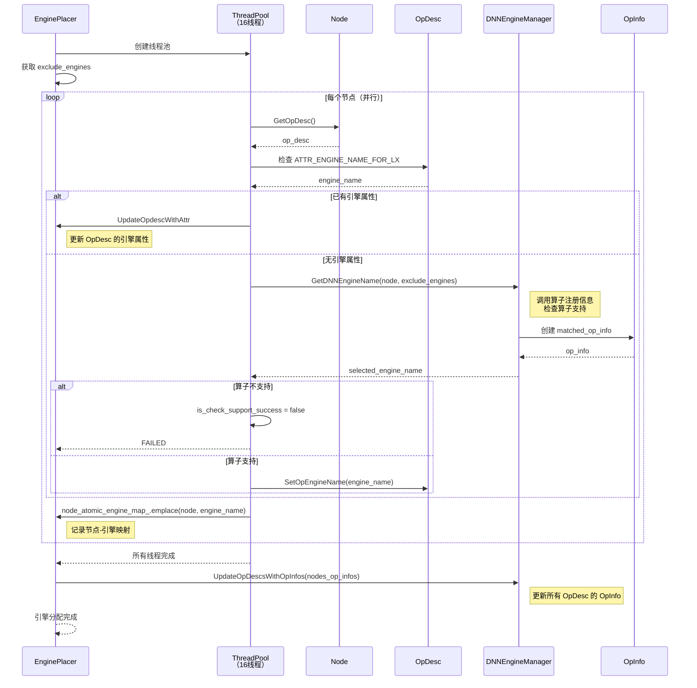
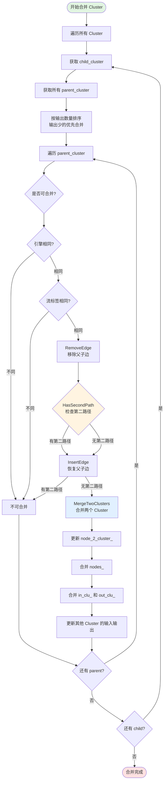
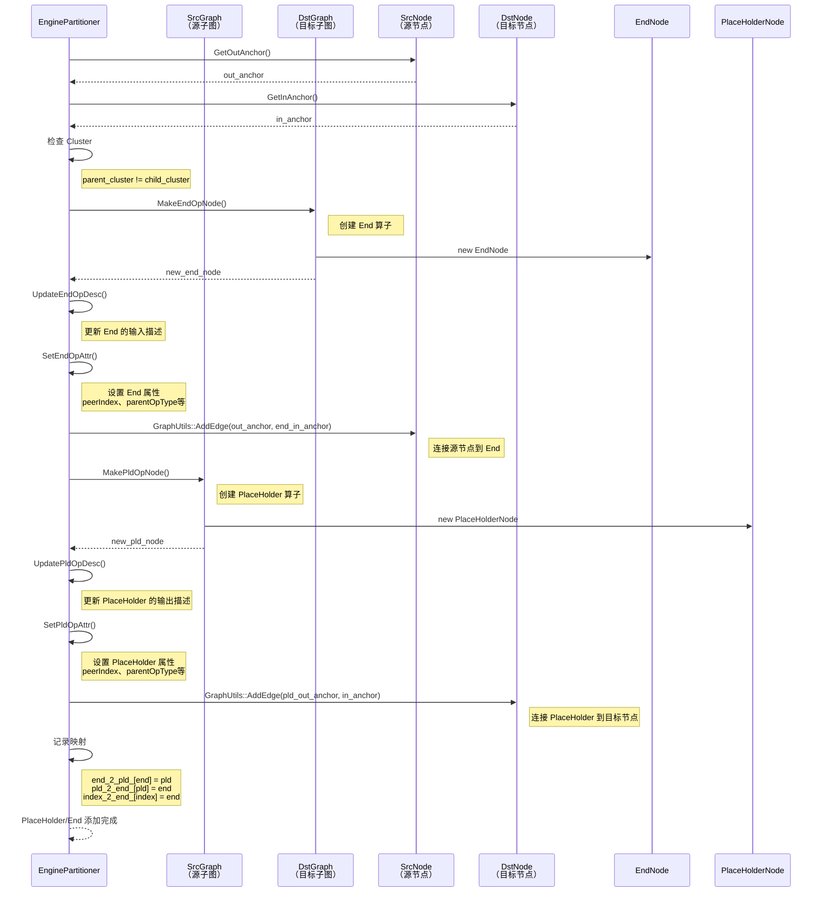
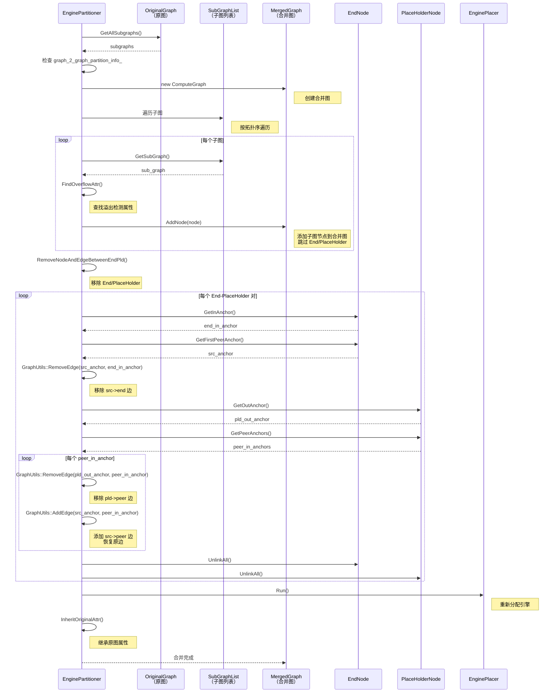
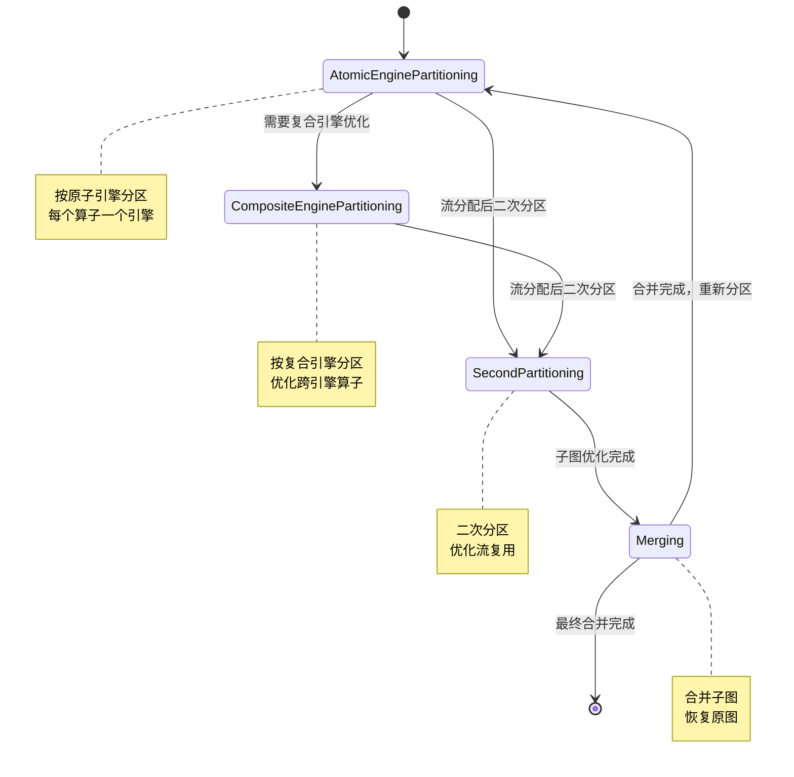
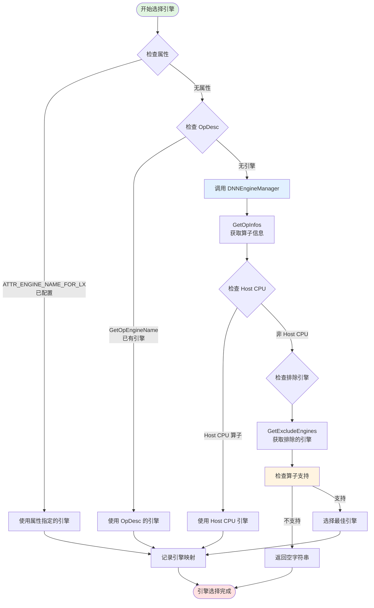

# GE 图引擎分引擎模块分析

## 一、问题背景：为什么需要引擎分区？

GE 图引擎面临一个根本性的架构挑战：**如何在一张图中同时处理不同引擎的算子？**

### 1.1 具体场景

**典型问题场景**：
- 用户模型中包含多种引擎的算子：
  - **AiCore引擎**：高性能计算算子（如 `Conv2D`、`MatMul`）
  - **AiVector引擎**：向量计算算子（如 `Add`、`Mul`）
  - **Host CPU引擎**：Host端计算算子（如 `Dynamic算子`）
  - **Custom引擎**：用户自定义算子
- 不同引擎的算子有不同的执行特性：
  - AiCore/AiVector：Device端执行，需要流分配
  - Host CPU：Host端执行，需要Host调度
  - Custom：可能依赖特定引擎
- 如果不分区，会导致：
  - 流分配混乱（不同引擎需要不同流）
  - 调度冲突（Host和Device算子调度方式不同）
  - 性能下降（无法做引擎级别的优化）

### 1.2 现有方案的不足

| 方案 | 问题 |
|------|------|
| **单引擎执行** | 无法支持多引擎算子，功能受限 |
| **用户手动分区** | 用户负担重，破坏模型可移植性 |
| **算子级别调度** | 调度开销大，无法做跨算子优化 |
| **忽略引擎差异** | 流分配和调度混乱，性能下降 |

### 1.3 GE 的解决方案

设计一套**自动化的引擎分区机制**，将一张混合图按引擎拆分成多个子图：
- **引擎子图**：每个子图包含同一引擎的算子
- **自动连接**：通过 `PlaceHolder` 和 `End` 算子连接子图
- **流分配优化**：每个引擎子图可以独立分配流
- **调度优化**：不同引擎子图可以采用不同的调度策略

**核心价值**：用户无需关心引擎分区细节，系统自动适配，既保证正确性，又最大化性能。

---

## 二、设计哲学：引擎隔离，流独立，自动连接

GE 的引擎分区遵循一个清晰的设计哲学：**"同引擎算子同子图，异引擎算子异子图，自动连接不丢数据"**。

这个哲学体现在三个核心原则：

### 2.1 原则一：引擎隔离

**动机**：不同引擎的算子有不同的执行特性，应隔离到不同子图。

**实现**：
- 每个节点通过 `EnginePlacer` 分配引擎
- 同引擎的节点合并到同一 Cluster
- 每个 Cluster 对应一个子图

**代码依据**：`engine_place.cc:44-85`（`SelectEngine`）

### 2.2 原则二：流独立

**动机**：不同引擎的算子需要不同的流，应独立分配。

**实现**：
- 每个子图可以独立分配流（通过 `stream_label_`）
- 同引擎子图可以复用流
- 异引擎子图必须分配不同流

**代码依据**：`engine_partitioner.h:42-43`（`Cluster::stream_label_`）

### 2.3 原则三：自动连接

**动机**：分区后数据流不能断，必须保证输入输出正确。

**实现**：
- 异引擎子图之间通过 `PlaceHolder` 和 `End` 算子连接
- `PlaceHolder`：占位符，表示来自其他子图的输入
- `End`：结束符，表示输出到其他子图
- 合并时自动移除 `PlaceHolder` 和 `End`，恢复原边

**代码依据**：`engine_partitioner.cc:636-682`（`AddPlaceHolderEndInSrcDstGraph`）

---

## 三、核心数据结构

### 3.1 Cluster：分区的基本单元

```cpp
class Cluster {
  size_t index_;              // 拓扑排序位置
  ClusterSet in_clu_;         // 输入 Cluster
  ClusterSet out_clu_;        // 输出 Cluster
  std::list<NodePtr> nodes_;  // 包含的节点
  std::string engine_name_;   // 引擎名称
  std::string stream_label_;  // 流标签
  std::string user_stream_label_; // 用户流标签
};
```

**设计亮点**：
- `index_` 记录拓扑位置，用于判断是否可以合并（避免环）
- `in_clu_` 和 `out_clu_` 记录 Cluster 间的连接关系
- `engine_name_` 和 `stream_label_` 用于分区和流分配

### 3.2 EnginePlacer：引擎分配器

```cpp
class EnginePlacer {
  ComputeGraphPtr compute_graph_;
  NodeEngineMap node_atomic_engine_map_;    // 原子引擎映射
  NodeEngineMap node_composite_engine_map_; // 复合引擎映射
  mutable std::mutex mutex_;
};
```

**核心职责**：
- 为每个节点选择引擎（`SelectEngine`）
- 多线程执行引擎选择（`Run`）
- 分配复合引擎（`AssignCompositeEngine`）
- 重新分配引擎（`ReAssignEngine`）

### 3.3 EnginePartitioner：分区器

```cpp
class EnginePartitioner {
  enum class Mode {
    kAtomicEnginePartitioning,    // 原子引擎分区
    kCompositeEnginePartitioning, // 复合引擎分区
    kSecondPartitioning,          // 二次分区
    kMerging                      // 合并模式
  };
  
  struct GraphPartitionInfo {
    PartitionMap partitions_;     // 子图映射
    std::unordered_map<NodePtr, ClusterPtr> node_2_cluster_;
    std::unordered_map<ClusterPtr, ComputeGraphPtr> cluster_2_partition_;
    NodetoNodeMap end_2_pld_;     // End 到 PlaceHolder 映射
    NodetoNodeMap pld_2_end_;     // PlaceHolder 到 End 映射
  };
  
  EnginePlacer engine_placer_;
  std::unordered_map<ComputeGraphPtr, GraphPartitionInfo> graph_2_graph_partition_info_;
};
```

**核心职责**：
- 初始化 Cluster（`Initialize`）
- 标记 Cluster（`MarkClusters`）
- 拆分子图（`SplitSubGraphs`）
- 合并子图（`MergeAfterSubGraphOptimization`）

### 3.4 DNNEngineManager：引擎管理器

```cpp
class DNNEngineManager {
  std::map<std::string, DNNEnginePtr> engines_map_;
  std::map<std::string, SchedulerConf> schedulers_;
  std::map<std::string, std::string> atomic_2_composite_;
};
```

**核心职责**：
- 管理所有引擎（`GetEngine`）
- 获取引擎名称（`GetDNNEngineName`）
- 获取复合引擎名称（`GetCompositeEngineName`）
- 获取排除的引擎（`GetExcludeEngines`）

---

## 四、核心流程

### 4.1 整体流程架构

```mermaid
flowchart TD
    Start([图预处理入口]) --> CheckGraph{检查图有效性}
    
    CheckGraph -->|无效| ReturnFailed[返回失败]
    CheckGraph -->|有效| TopoSort[拓扑排序]
    
    TopoSort --> CheckMode{分区模式}
    
    CheckMode -->|复合引擎分区| AssignComposite[AssignCompositeEngine<br/>分配复合引擎]
    CheckMode -->|原子引擎分区| InitPartition[初始化分区信息]
    CheckMode -->|二次分区| InitPartition
    CheckMode -->|合并模式| Merge[MergeSubGraph<br/>合并子图]
    
    AssignComposite --> InitPartition
    
    InitPartition --> ClearData[ClearAllPartitionData<br/>清理分区数据]
    
    ClearData --> PartitionSubGraph[PartitionSubGraph<br/>分区子图]
    
    PartitionSubGraph --> Initialize[Initialize<br/>初始化 Cluster]
    
    Initialize --> EnginePlacerRun[EnginePlacer::Run<br/>多线程分配引擎]
    
    EnginePlacerRun --> SelectEngine[SelectEngine<br/>选择引擎]
    
    SelectEngine --> CheckEngineAttr{检查引擎属性}
    
    CheckEngineAttr -->|已有引擎属性| UpdateOpDesc[UpdateOpdescWithAttr<br/>更新 OpDesc]
    CheckEngineAttr -->|无引擎属性| GetEngineName[GetDNNEngineName<br/>获取引擎名称]
    
    GetEngineName --> CheckSupport{检查算子支持}
    
    CheckSupport -->|不支持| ReturnFailed
    CheckSupport -->|支持| RecordEngine[记录引擎映射<br/>node_atomic_engine_map_]
    
    UpdateOpDesc --> RecordEngine
    
    RecordEngine --> CreateCluster[创建 Cluster<br/>每个节点一个 Cluster]
    
    CreateCluster --> InitInputClusters[InitializeInputClusters<br/>初始化输入 Cluster]
    
    InitInputClusters --> MarkClusters[MarkClusters<br/>标记 Cluster]
    
    MarkClusters --> CheckTopoMode{拓扑排序模式}
    
    CheckTopoMode -->|stable_rdfs_sort| MarkConsistantId[MarkClustersWithConsistantId<br/>保持 ID 一致性]
    CheckTopoMode -->|其他| MarkNormal[MarkClusters<br/>常规标记]
    
    MarkConsistantId --> SplitSubGraphs[SplitSubGraphs<br/>拆分子图]
    MarkNormal --> SplitSubGraphs
    
    SplitSubGraphs --> CreateSubGraph[创建子图<br/>每个 Cluster 一个子图]
    
    CreateSubGraph --> SplitNodeInputs[SplitNodeInputs<br/>拆分节点输入]
    
    SplitNodeInputs --> CheckCluster{检查 Cluster}
    
    CheckCluster -->|同 Cluster| AddEdge[AddEdge<br/>添加边]
    CheckCluster -->|异 Cluster| AddPlaceHolderEnd[AddPlaceHolderEnd<br/>添加 PlaceHolder/End]
    
    AddEdge --> NextNode{还有节点?}
    AddPlaceHolderEnd --> NextNode
    
    NextNode -->|是| SplitNodeInputs
    NextNode -->|否| SortSubGraphs[SortSubGraphs<br/>拓扑排序子图]
    
    SortSubGraphs --> AddPartitions[AddPartitionsToGraphNode<br/>添加分区到图节点]
    
    AddPartitions --> CheckSubGraph{检查子图}
    
    CheckSubGraph -->|有子图| PartitionSubGraph
    CheckSubGraph -->|无子图| End([分区完成])
    
    Merge --> RemoveEndPld[RemoveNodeAndEdgeBetweenEndPld<br/>移除 PlaceHolder/End]
    
    RemoveEndPld --> MergeAllSubGraph[MergeAllSubGraph<br/>合并所有子图]
    
    MergeAllSubGraph --> InheritAttr[InheritOriginalAttr<br/>继承原图属性]
    
    InheritAttr --> EnginePlacerRun2[EnginePlacer::Run<br/>重新分配引擎]
    
    EnginePlacerRun2 --> End
    
    ReturnFailed --> End
    
    style Start fill:#e1f5e1
    style End fill:#ffe1e1
    style PartitionSubGraph fill:#e1f0ff
    style MarkClusters fill:#f0e1ff
    style SplitSubGraphs fill:#fff4e1
    style Merge fill:#f5f5f5
```



### 4.2 引擎选择流程



### 4.3 Cluster 合并流程



### 4.4 PlaceHolder/End 添加流程



### 4.5 子图合并流程



---

## 五、关键设计决策

### 5.1 为什么用 Cluster 作为分区单元？

**决策**：用 Cluster（一组节点）作为分区的基本单元，而不是单个节点。

**替代方案**：
1. **节点级别分区**：每个节点一个子图，调度开销大
2. **算子类型分区**：按算子类型分区，无法处理引擎差异
3. **用户手动分区**：用户负担重，破坏可移植性

**权衡分析**：
- Cluster 可以**最大化子图大小**，减少调度开销
- Cluster 内部可以做**跨算子优化**（如算子融合）
- Cluster 的合并逻辑可以**动态调整**，适应不同场景
- 代价是 Cluster 的合并逻辑复杂，需要处理环检测、拓扑排序等

**代码依据**：`engine_partitioner.h:35-51`

### 5.2 为什么需要 PlaceHolder/End 机制？

**决策**：异引擎子图之间通过 PlaceHolder 和 End 算子连接。

**设计动机**：
- 子图之间需要**数据传递**，但不能直接连接（不同引擎）
- PlaceHolder 表示**占位符**，表示来自其他子图的输入
- End 表示**结束符**，表示输出到其他子图
- 合并时自动移除，恢复原边

**PlaceHolder 属性**：
- `peerIndex`：对应的 End 算子索引
- `parentOpType`：源节点类型
- `parentNodeName`：源节点名称
- `anchorIndex`：锚点索引

**End 属性**：
- `peerIndex`：对应的 PlaceHolder 算子索引
- `parentOpType`：目标节点类型

**代码依据**：`engine_partitioner.cc:586-634`

### 5.3 为什么需要环检测？

**决策**：合并 Cluster 时，需要检查是否会产生环。

**设计动机**：
- Cluster 合并可能产生环（如 A->B->C，合并 A 和 C 会产生环）
- 环会导致**拓扑排序失败**，无法构建子图
- `HasSecondPath` 通过 DFS 检查是否存在第二路径

**环检测逻辑**：
```cpp
bool HasSecondPath(size_t src, size_t dst, size_t upper_bound) {
  // 移除 src->dst 的直接边
  RemoveEdge(src, dst);
  
  // DFS 检查是否存在 src 到 dst 的第二路径
  std::vector<size_t> temp_stack;
  std::set<size_t> visited;
  temp_stack.push_back(src);
  
  while (!temp_stack.empty()) {
    size_t cluster = temp_stack.back();
    temp_stack.pop_back();
    
    for (auto out : clusters_[cluster]->out_clu_) {
      if (out == dst) {
        return true;  // 存在第二路径，会产生环
      }
      if (out < upper_bound) {
        temp_stack.push_back(out);
      }
    }
  }
  
  return false;
}
```

**代码依据**：`engine_partitioner.cc:1221-1260`

### 5.4 为什么需要多线程引擎选择？

**决策**：引擎选择使用多线程（16线程）并行执行。

**设计动机**：
- 引擎选择需要**调用算子注册信息**，检查算子支持
- 检查支持是**耗时操作**，需要调用 FE 算子库
- 多线程可以**加速引擎选择**，减少编译时间

**实现细节**：
- 使用 ThreadPool 创建 16 个线程
- 每个线程独立处理节点
- 使用 mutex 保护共享数据（`node_atomic_engine_map_`）
- 使用 `std::future` 收集线程结果

**代码依据**：`engine_place.cc:130-180`

### 5.5 为什么需要复合引擎？

**决策**：除了原子引擎，还需要复合引擎。

**设计动机**：
- **原子引擎**：单个算子引擎（如 AiCore、AiVector）
- **复合引擎**：多个原子引擎的组合（如 AiCore+AiVector）
- 复合引擎可以**优化跨引擎算子**，减少子图数量

**实现细节**：
- `AssignCompositeEngine`：分配复合引擎
- `atomic_2_composite_`：原子引擎到复合引擎的映射
- 复合引擎分区模式：`kCompositeEnginePartitioning`

**代码依据**：`engine_place.cc:182-207`

---

## 六、模块间协作关系

### 6.1 协作模式分析

- **EnginePlacer**：负责为每个节点分配引擎
- **DNNEngineManager**：管理所有引擎，提供引擎选择接口
- **ThreadPool**：多线程执行引擎选择，加速编译
- **GraphPartitionInfo**：记录分区信息，包括 Cluster、子图、End-PlaceHolder 映射
- **PlaceHolder/End**：连接异引擎子图，保证数据流正确

---

## 七、业界对比与设计洞察

### 7.1 与其他框架的引擎分区对比

| 框架 | 引擎分区方案 | 设计哲学 | 优缺点 |
|------|------------|----------|--------|
| **TensorFlow XLA** | 按设备分区（CPU/GPU） | 设备隔离 | 优点：简单；缺点：无法处理同设备多引擎 |
| **PyTorch TorchScript** | 按算子类型分区 | 算子隔离 | 优点：灵活；缺点：无法优化跨算子 |
| **ONNX Runtime** | 按执行提供者分区 | 提供者隔离 | 优点：跨框架；缺点：无法做跨提供者优化 |
| **GE** | 按引擎分区 + Cluster 合并 | 引擎隔离 + 优化 | 优点：最大化优化；缺点：分区逻辑复杂 |

### 7.2 GE 的独特之处

- **Cluster 抽象**：用 Cluster 作为分区单元，而不是节点
- **PlaceHolder/End 机制**：异引擎子图自动连接，保证数据流正确
- **环检测**：合并 Cluster 时检查环，避免拓扑排序失败
- **多线程引擎选择**：加速编译，减少等待时间
- **复合引擎**：优化跨引擎算子，减少子图数量

### 7.3 如果重新设计，可能的改进方向

1. **引入更智能的合并策略**：
   - 当前合并策略基于拓扑排序和引擎类型，可以引入**性能预估模型**
   - 根据算子执行时间、内存占用等预估子图性能，优化合并策略

2. **支持跨子图优化**：
   - 当前子图内部可以做优化，但跨子图无法优化
   - 可以引入**跨子图算子融合**，如将 PlaceHolder 前后的算子融合

3. **增强引擎选择性能**：
   - 当前引擎选择需要调用 FE 算子库，开销大
   - 可以引入**引擎选择缓存**，避免重复检查

4. **支持动态引擎分区**：
   - 当前分区是静态的，无法适应动态场景
   - 可以引入**动态分区机制**，根据运行时信息调整分区

---

## 八、亮点与问题

### 8.1 亮点

1. **自动化程度高**：用户无需关心引擎分区细节，系统自动适配
2. **Cluster 抽象精妙**：用 Cluster 作为分区单元，最大化子图大小
3. **PlaceHolder/End 机制优雅**：异引擎子图自动连接，保证数据流正确
4. **环检测保证正确性**：合并 Cluster 时检查环，避免拓扑排序失败
5. **多线程加速编译**：引擎选择并行执行，减少编译时间

### 8.2 问题

1. **分区逻辑复杂**：多种分区模式（原子、复合、二次），理解难度大
2. **环检测开销大**：DFS 检查第二路径，大规模图时开销大
3. **引擎选择耗时**：调用 FE 算子库检查支持，开销大
4. **PlaceHolder/End 增加复杂度**：合并时需要移除，增加复杂度
5. **缺少性能预估**：合并策略基于拓扑，缺少性能预估模型

---

## 九、总结与启发

### 9.1 核心启发

- **Cluster 是分区的基本单元**：用 Cluster 而不是节点，最大化子图大小
- **PlaceHolder/End 保证数据流**：异引擎子图自动连接，避免数据流断裂
- **环检测保证正确性**：合并 Cluster 时检查环，避免拓扑排序失败
- **多线程加速编译**：引擎选择并行执行，减少编译时间
- **复合引擎优化跨引擎算子**：减少子图数量，提升性能

### 9.2 适用场景

- 需要处理多引擎算子的框架
- 需要优化流分配的系统
- 需要减少调度开销的场景

---

## 十、调用入口汇总

| 调用位置 | 文件路径 | 调用场景 |
|---------|---------|---------|
| 图预处理 | `compiler/graph/preprocess/graph_prepare.cc` | 图编译前的预处理阶段 |
| 图管理器 | `compiler/graph/manager/graph_manager.cc` | 图管理器统一入口 |
| FE 图优化 | `compiler/engines/nn_engine/optimizer/graph_optimizer/fe_graph_optimizer.cc` | FE 图优化器 |

---

## 十一、分区模式详解

### 11.1 四种分区模式

```cpp
enum class Mode {
  kAtomicEnginePartitioning,    // 原子引擎分区
  kCompositeEnginePartitioning, // 复合引擎分区
  kSecondPartitioning,          // 二次分区
  kMerging                      // 合并模式
};
```

**模式说明**：

| 模式 | 说明 | 适用场景 |
|------|------|----------|
| **kAtomicEnginePartitioning** | 按原子引擎分区 | 常规分区，每个算子分配原子引擎 |
| **kCompositeEnginePartitioning** | 按复合引擎分区 | 优化跨引擎算子，减少子图数量 |
| **kSecondPartitioning** | 二次分区 | 流分配后的二次分区，优化流复用 |
| **kMerging** | 合并模式 | 子图优化后合并，恢复原图 |

### 11.2 分区模式的切换流程



---

## 十二、引擎选择详解

### 12.1 引擎选择的优先级



### 12.2 引擎选择的实现细节

**关键函数**：`DNNEngineManager::GetDNNEngineName`

**实现逻辑**：
1. 获取算子的所有 OpInfo（算子注册信息）
2. 检查算子是否为 Host CPU 算子
3. 排除不支持的引擎
4. 选择最佳引擎（基于性能、支持度等）

**代码依据**：`dnnengine_manager.cc`

---

**分析日期**：2026-05-08  
**分析工具**：repo-analyzer skill  
**代码版本**：GE trunk_ai/ge